# GestureBot Vision System

[](https://docs.ros.org/en/jazzy/)
[](https://www.raspberrypi.org/)
[](https://mediapipe.dev/)
[](LICENSE)

<table>
<tr>
<td width="300">
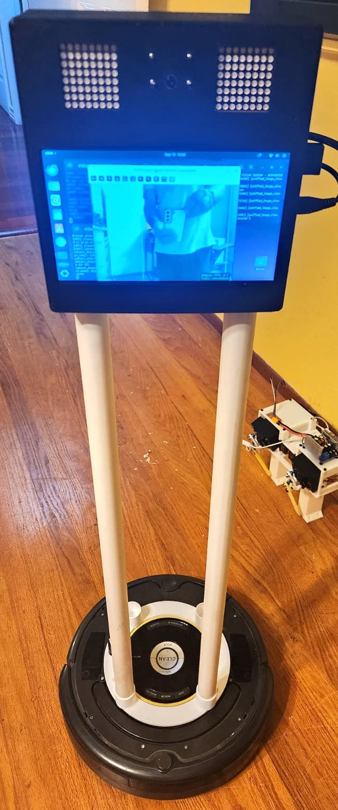
</td>
<td valign="top">

**Comprehensive MediaPipe-based computer vision system for robotics applications**, specifically designed for the GestureBot platform running on Raspberry Pi 5 with ROS 2 Jazzy.

The system provides three ML-powered vision pipelines that translate camera input into structured ROS 2 messages, enabling natural human-robot interaction without traditional input devices.

**Vision Capabilities:**
- 🎯 **Object Detection** — EfficientDet-Lite detecting 80 COCO classes at ~15 FPS
- 🖐️ **Gesture Recognition** — 7 hand gestures with 21-point landmark tracking
- 🏃 **Pose Detection** — 33-point body landmark tracking with real-time classification

**Navigation Modes:**
- 🧭 **4-Pose Navigation** — Control robot movement with body poses (arms raised, pointing, t-pose)
- 👤 **Person Following** — Autonomous following with distance maintenance (0.8m–5.0m range)
- ✋ **Gesture Control** — Direct velocity commands via hand gestures

**Platform Features:**
- 🔧 **iRobot Create 2** base with differential drive
- 📷 **Raspberry Pi Camera Module 3** (IMX708, 640×480 @ 30 FPS)
- ⚡ **25 Hz velocity smoothing** for stable motion control
- 🛡️ **Multi-layer safety** — timeout protection, emergency stops, confidence thresholds

Control your robot through intuitive hand gestures and body poses!

</td>
</tr>
</table>

## 📋 Table of Contents

- [🚀 Quick Start](#quick-start)

- **[1. Vision System Architecture](#1-vision-system-architecture)**
  - [Hardware Architecture](#hardware-architecture)
    - [Component Details](#component-details)
    - [CAD Design](#cad-design)
    - [Assembled Hardware](#assembled-hardware)
  - [Software Architecture](#software-architecture)
    - [Component Layout](#component-layout)
    - [Class Structure](#class-structure)
    - [ROS 2 Package Structure](#ros-2-package-structure)
    - [Control Flow](#control-flow)

- **[2. Object Detection](#2-object-detection)**
  - [Model Architecture](#model-architecture)
  - [Model Variants & Quantization](#model-variants--quantization)
  - [Model Performance](#model-performance)
    - [Accuracy](#accuracy)
    - [Precision-Recall Curve](#precision-recall-curve)
  - [Configuration Reference](#configuration-reference)
  - [Parameter Tuning and Optimization](#parameter-tuning-and-optimization)
    - [Camera Frame Rate](#camera-frame-rate)
    - [Camera Exposure Time](#camera-exposure-time)
    - [Frame Skip](#frame-skip)
    - [Confidence Threshold](#confidence-threshold)
  - [System Performance - Latency/CPU/Memory](#system-performance---latencycpumemory)

- **[3. Gesture Recognition](#3-gesture-recognition)**
  - [Model Architecture](#model-architecture-1)
  - [Model Variants & Quantization](#model-variants--quantization-1)
  - [Model Performance](#model-performance-1)
  - [Configuration Reference](#configuration-reference-1)
  - [System Performance - Latency/CPU/Memory](#system-performance---latencycpumemory-1)

- **[4. Pose Detection](#4-pose-detection)**
  - [Model Architecture](#model-architecture-2)
  - [Model Variants & Quantization](#model-variants--quantization-2)
  - [Model Performance](#model-performance-2)
  - [Configuration Reference](#configuration-reference-2)
  - [System Performance - Latency/CPU/Memory](#system-performance---latencycpumemory-2)

- **[5. Navigation Integration](#5-navigation-integration)**
  - [Gesture-based Robot Control](#gesture-based-robot-control)
  - [4-Pose Navigation System](#4-pose-navigation-system)
  - [Standalone Person Following](#standalone-person-following)
  - [Safety Systems](#safety-systems)
  - [Emergency Stop Features](#emergency-stop-features)
  - [Visual Servoing](#visual-servoing)

- **[6. Getting Started](#6-getting-started)**
  - [Prerequisites](#prerequisites)
  - [Installation](#installation)
  - [Running the System](#running-the-system)
  - [Image Viewer](#image-viewer)
  - [Configuration](#configuration)

- **[7. Troubleshooting](#7-troubleshooting)**
  - [Common Issues](#common-issues)
  - [Performance Problems](#performance-problems)
  - [Hardware Debugging](#hardware-debugging)
  - [Build Dependencies](#build-dependencies)
  - [Parameter Type Issues](#parameter-type-issues)

---

<a id="quick-start"></a>
## 🚀 Quick Start

### For Existing Setup
```bash
# Activate GestureBot environment (includes virtual env + ROS 2)
cd ~/GestureBot/gesturebot_ws
source activate_gesturebot.sh

# Launch object detection system with annotated images
ros2 launch gesturebot object_detection.launch.py camera_format:=RGB888

# Launch pose detection system with 33-point landmarks
ros2 launch gesturebot pose_detection.launch.py

# Launch 4-pose navigation system (NEW!)
ros2 launch gesturebot pose_navigation_bridge.launch.py

# Launch standalone person following system (NEW!)
ros2 launch gesturebot person_following.launch.py

# View annotated vision output (in separate terminal)
ros2 run gesturebot image_viewer_node.py --ros-args \
    -p image_topic:=/vision/objects/annotated

# View pose detection with skeleton visualization
ros2 run gesturebot image_viewer_node.py --ros-args \
    -p image_topic:=/vision/poses/annotated

# Test package functionality
python3 -c "import rclpy, mediapipe; print('✅ gesturebot package ready!')"

# Run package tests
cd src/gesturebot/test
python3 quick_test.py
```

### For New Setup
```bash
# 1. Create and activate virtual environment
cd ~/GestureBot
python3 -m venv gesturebot_env
source gesturebot_env/bin/activate

# 2. Install Python dependencies from requirements file
pip install --upgrade pip setuptools wheel
pip install -r requirements.txt

# 3. Build this package specifically
cd gesturebot_ws
source /opt/ros/jazzy/setup.bash
colcon build --packages-select gesturebot
source install/setup.bash

# 4. Verify installation
python3 -c "import rclpy, mediapipe; print('✅ gesturebot package ready!')"
```

## 1. Vision System Architecture

The GestureBot vision system is built on a **modular architecture** designed for flexibility, reusability, and ease of development:

| Modularity Aspect | Description |
|-------------------|-------------|
| **Launch File Modularity** | Each vision feature (object detection, gesture recognition, pose detection) can be launched independently for isolated development, testing, and debugging |
| **MediaPipe Implementation** | The `ros2_mediapipe` package provides a reusable vision processing framework showcased through GestureBot |
| **Controller Modularity** | Navigation bridges are independent, swappable controllers that translate vision results to robot commands |
| **Visualization Modularity** | Unified image viewer supports multiple annotated image topics through a single configurable node |

**ros2_mediapipe Package Design:**
- **Base Class Architecture**: `MediaPipeBaseNode` provides common infrastructure (camera subscription, image conversion, async processing)
- **Independent Vision Nodes**: `ObjectDetectionNode`, `GestureRecognitionNode`, `PoseDetectionNode` extend the base class
- **Reusable Message Definitions**: Custom ROS 2 messages (`DetectedObjects`, `HandGesture`, `PoseLandmarks`) for structured vision data
- **Separation of Concerns**: Vision processing (`ros2_mediapipe`) is decoupled from application logic (`gesturebot`)

### Hardware Architecture

The GestureBot platform integrates several hardware components for autonomous vision-based navigation and human-robot interaction.

#### Hardware Architecture Diagram

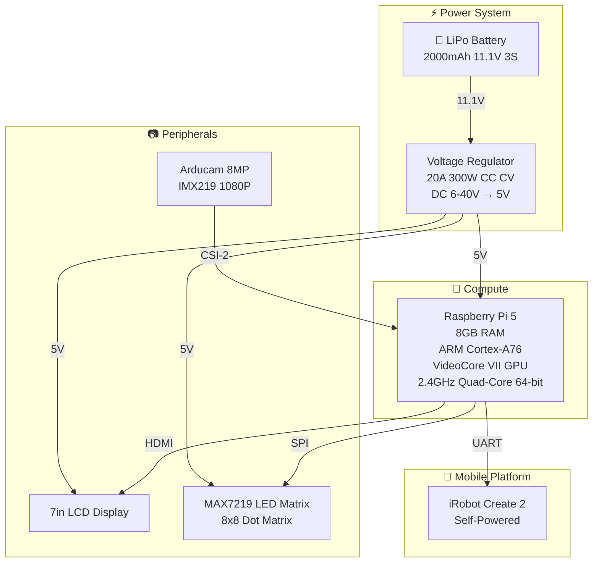
```mermaid
flowchart TB
    subgraph POWER["⚡ Power System"]
        BATT["🔋 LiPo Battery<br/>2000mAh 11.1V 3S"]
        VREG["Voltage Regulator<br/>20A 300W CC CV<br/>DC 6-40V → 5V"]
    end

    subgraph COMPUTE["🧠 Compute"]
        PI5["Raspberry Pi 5<br/>8GB RAM<br/>ARM Cortex-A76<br/>VideoCore VII GPU<br/>2.4GHz Quad-Core 64-bit"]
    end

    subgraph PERIPHERALS["📷 Peripherals"]
        CAM["Arducam 8MP<br/>IMX219 1080P"]
        LCD["7in LCD Display"]
        LED["MAX7219 LED Matrix<br/>8x8 Dot Matrix"]
    end

    subgraph MOBILE["🤖 Mobile Platform"]
        ROBOT["iRobot Create 2<br/>Self-Powered"]
    end

    BATT -->|"11.1V"| VREG
    VREG -->|"5V"| PI5
    VREG -->|"5V"| LCD
    VREG -->|"5V"| LED
    CAM -->|"CSI-2"| PI5
    PI5 -->|"UART"| ROBOT
    PI5 -->|"SPI"| LED
    PI5 -->|"HDMI"| LCD
```

#### Component Details

| Component | Specifications | Interface |
|-----------|---------------|-----------|
| **LiPo Battery** | 2000mAh, 11.1V, 3S configuration | Powers voltage regulator |
| **Raspberry Pi 5** | 8GB RAM, ARM Cortex-A76 quad-core, hardware acceleration for image processing | Central compute hub |
| **Arducam 8MP Camera** | IMX219 sensor, 1080P @ 30fps, autofocus | CSI-2 ribbon cable |
| **iRobot Create 2** | Mobile robot platform, self-powered battery | UART serial interface |
| **7" LCD Display** | Touch-capable display for debugging/visualization | HDMI |
| **MAX7219 LED Matrix** | 8x8 dot matrix for status indicators | SPI via 3.3V-to-5V level shifter |
| **Voltage Regulator** | 20A 300W CC CV Step Down (DC 6-40V to 5V), short circuit protection | Powers Pi 5, LCD, LED Matrix |

#### Hardware Connections

- **LiPo Battery → Voltage Regulator**: 11.1V input to the DC 6-40V input range of the step-down module
- **Voltage Regulator → Components**: Stable 5V output to Raspberry Pi 5, LCD screen, and LED matrix with short circuit protection
- **Camera → Pi 5**: CSI-2 ribbon cable provides high-bandwidth image data transfer
- **LED Matrix → Pi 5**: SPI interface through a 3.3V-to-5V level shifter (Pi GPIO is 3.3V, MAX7219 requires 5V logic)
- **iRobot Create 2 → Pi 5**: UART serial interface for motor commands and odometry feedback

#### CAD Design

| Image | Description |
|-------|-------------|
| 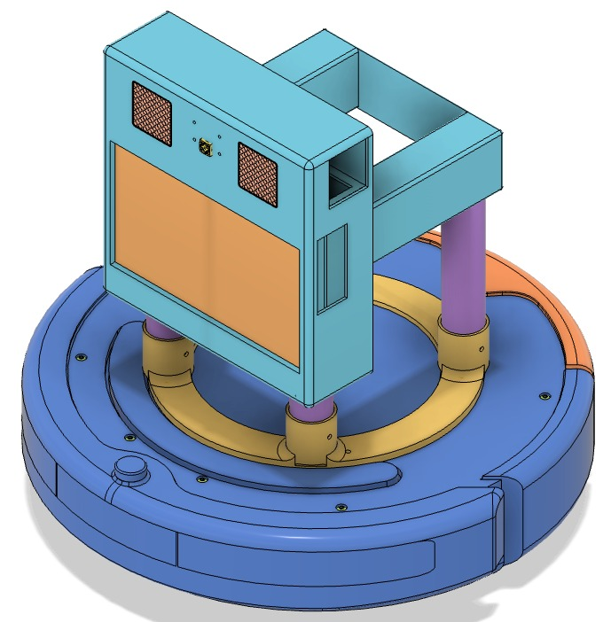 | **Component Overview**: LED matrix display, 7" LCD screen, and iRobot Create 2 mobile platform integration |
| 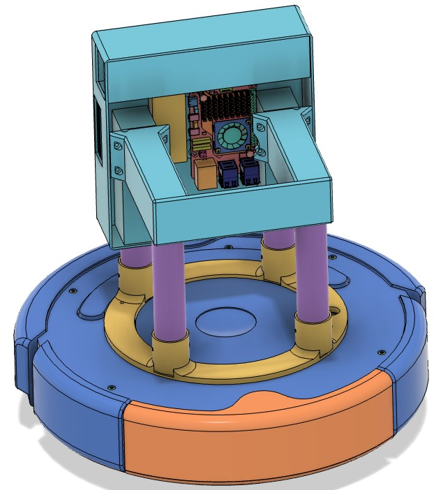 | **Electronics Detail**: Raspberry Pi 5, voltage regulator |
| 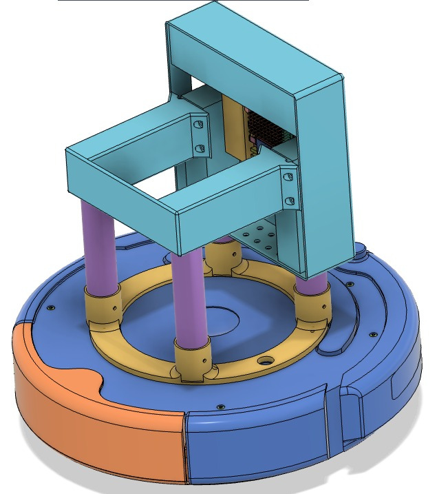 | **Enclosure Design**: Mounting structure and component housing |

#### Assembled Hardware

| Image | Description |
|-------|-------------|
| 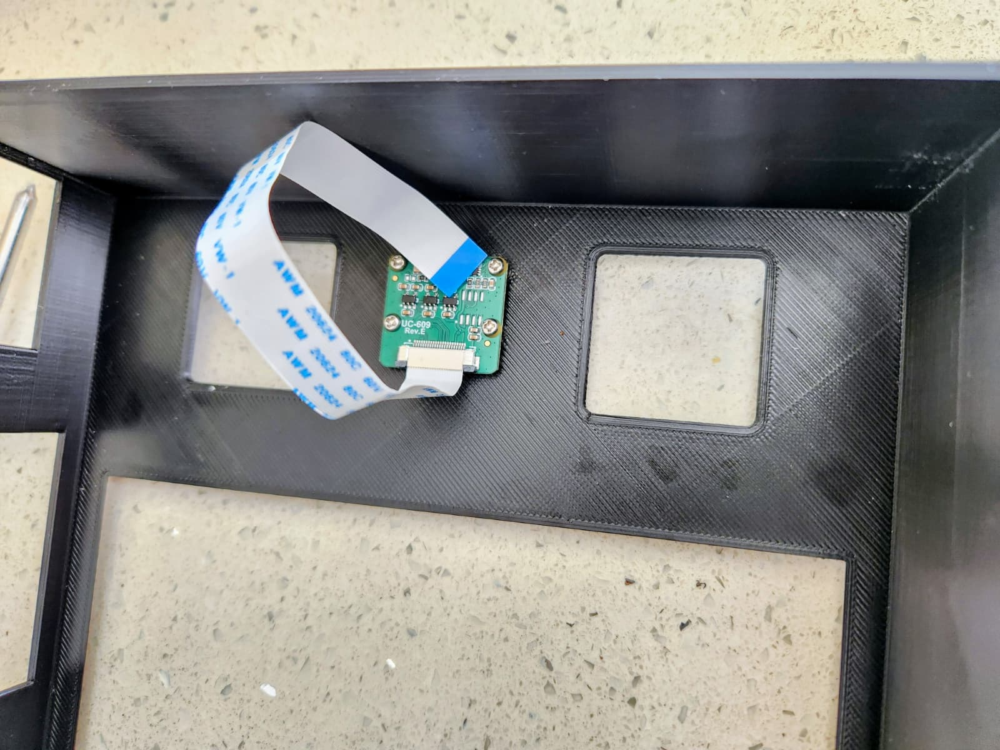 | **Camera**: IMX219 1080P |
| 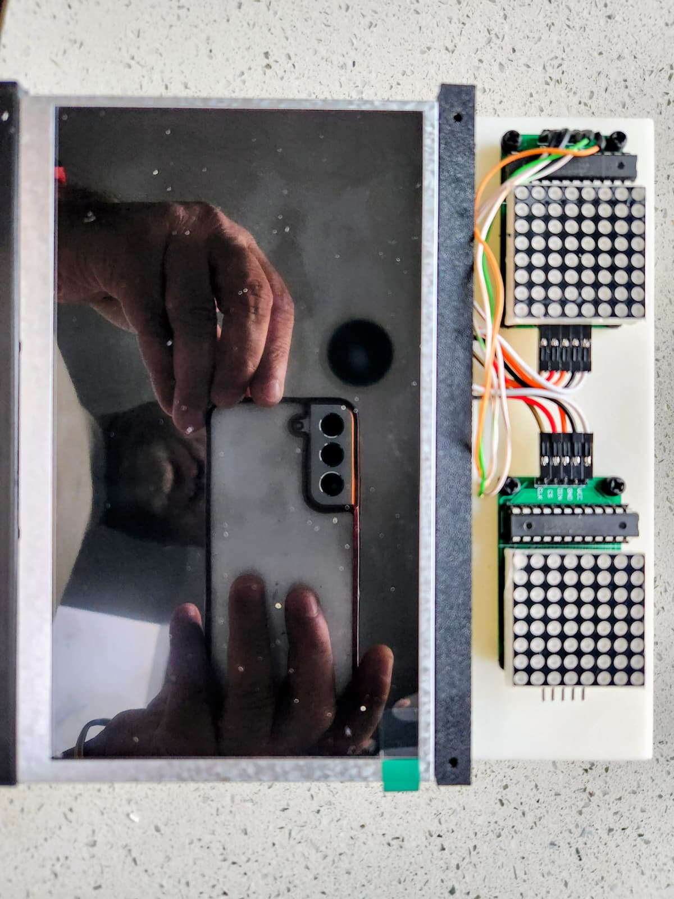 | **8x8 LED Matrix**: MAX7219 SPI |
| 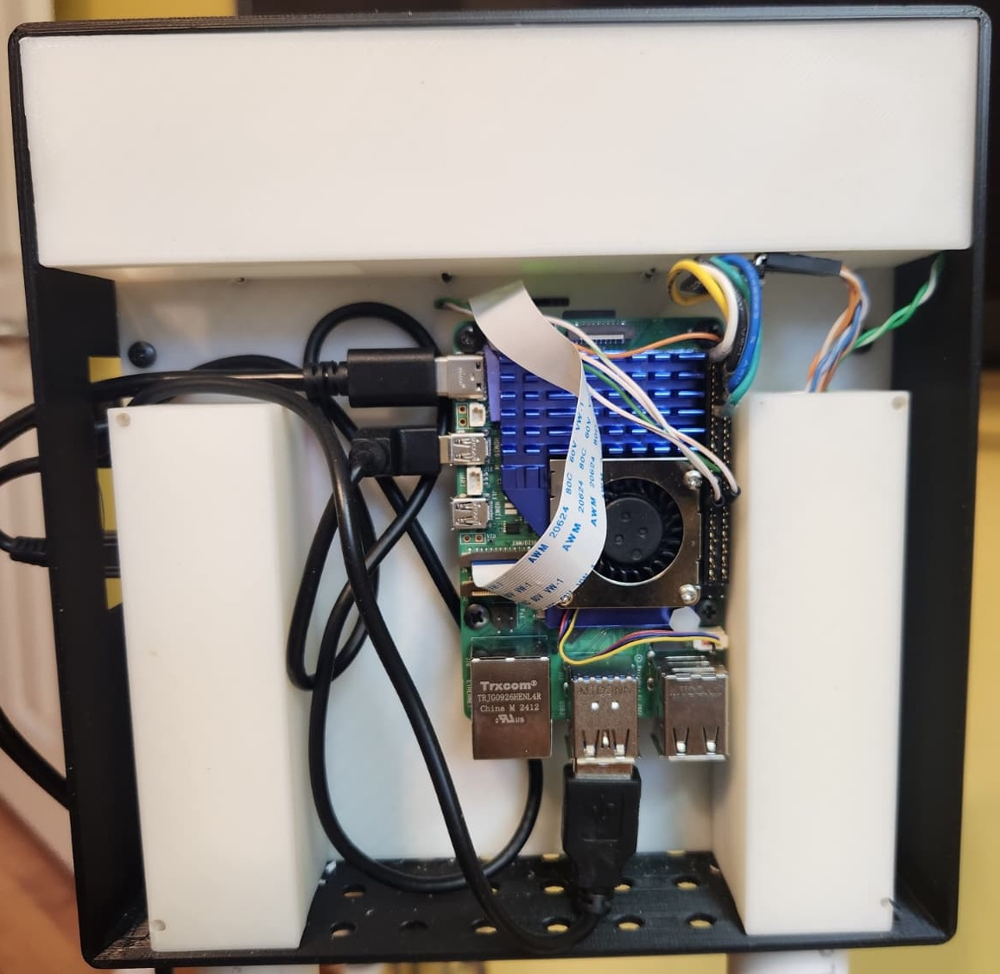 | **Enclosure Back**: 3D-printed housing back view with mounted components |
| 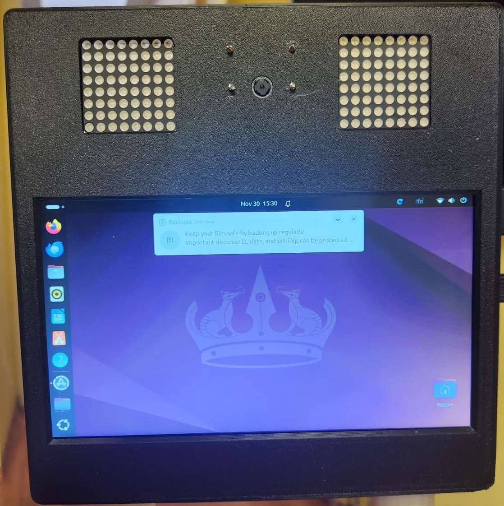 | **Enclosure Front**: 3D-printed housing front view with camera, LCD, and LED matrix |
| 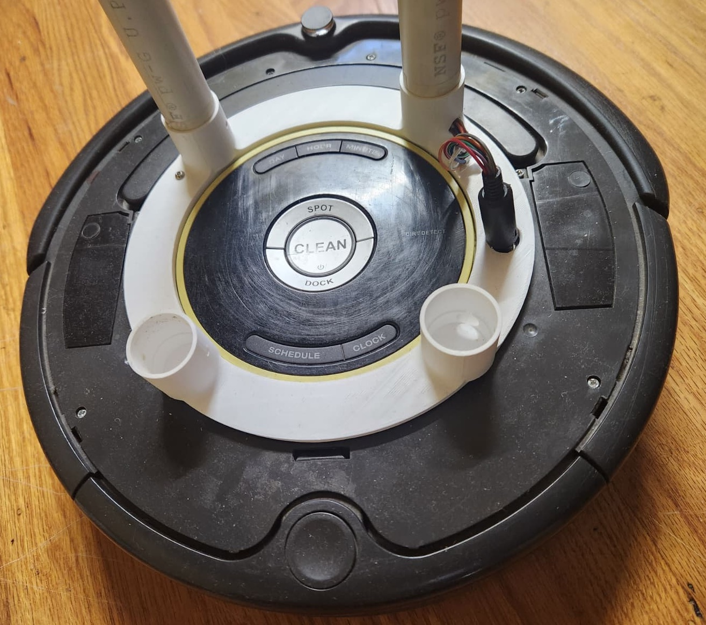 | **Mobile Platform**: iRobot Create 2 |

### Software Architecture

The software stack is organized into distinct layers, from low-level camera drivers to high-level navigation controllers.

#### Component Layout

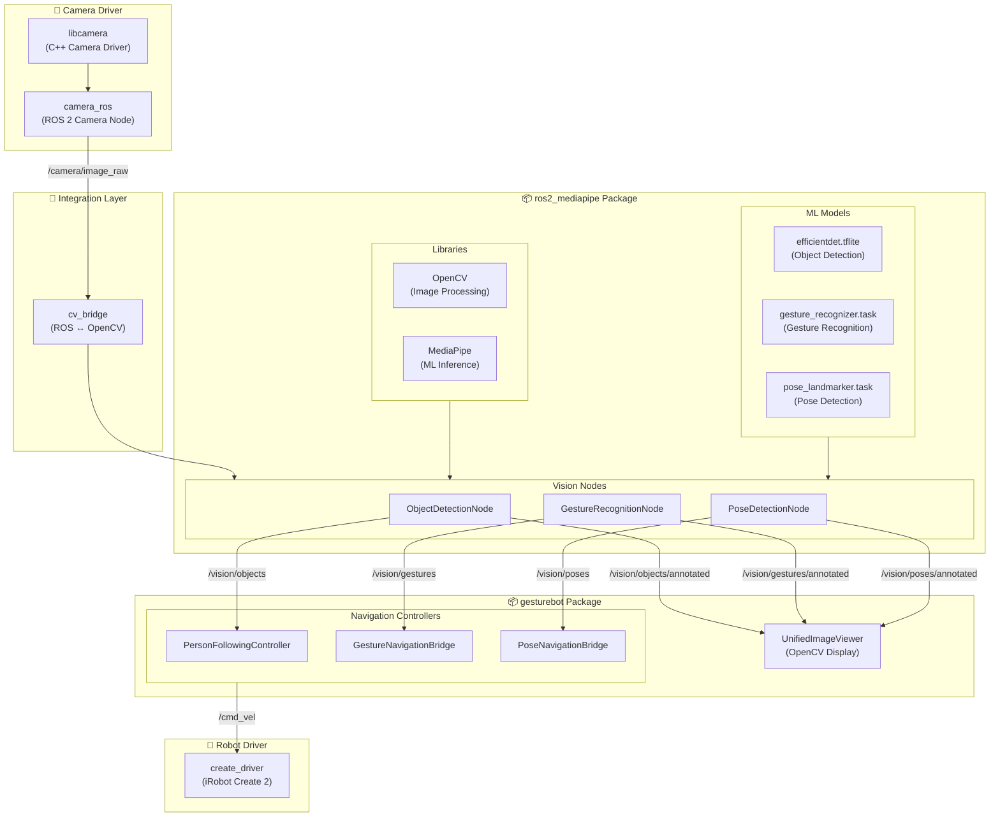
```mermaid
flowchart TB
    subgraph INPUT["🔧 Camera Driver"]
        LIBCAM["libcamera<br/>(C++ Camera Driver)"]
        CAMROS["camera_ros<br/>(ROS 2 Camera Node)"]
    end

    subgraph INTEGRATION["🔗 Integration Layer"]
        CVBRIDGE["cv_bridge<br/>(ROS ↔ OpenCV)"]
    end

    subgraph VISION["📦 ros2_mediapipe Package"]
        subgraph LIBS["Libraries"]
            OPENCV["OpenCV<br/>(Image Processing)"]
            MP["MediaPipe<br/>(ML Inference)"]
        end

        subgraph MODELS["ML Models"]
            M_OBJ["efficientdet.tflite<br/>(Object Detection)"]
            M_GES["gesture_recognizer.task<br/>(Gesture Recognition)"]
            M_POSE["pose_landmarker.task<br/>(Pose Detection)"]
        end

        subgraph NODES["Vision Nodes"]
            N_OBJ["ObjectDetectionNode"]
            N_GES["GestureRecognitionNode"]
            N_POSE["PoseDetectionNode"]
        end
    end

    subgraph APP["📦 gesturebot Package"]
        subgraph CTRL["Navigation Controllers"]
            C_FOLLOW["PersonFollowingController"]
            C_GES["GestureNavigationBridge"]
            C_POSE["PoseNavigationBridge"]
        end

        VIEWER["UnifiedImageViewer<br/>(OpenCV Display)"]
    end

    subgraph OUTPUT["🔧 Robot Driver"]
        CREATEDRV["create_driver<br/>(iRobot Create 2)"]
    end

    LIBCAM --> CAMROS
    CAMROS -->|"/camera/image_raw"| CVBRIDGE
    CVBRIDGE --> NODES

    LIBS --> NODES
    MODELS --> NODES

    N_OBJ -->|"/vision/objects"| C_FOLLOW
    N_GES -->|"/vision/gestures"| C_GES
    N_POSE -->|"/vision/poses"| C_POSE

    N_OBJ -->|"/vision/objects/annotated"| VIEWER
    N_GES -->|"/vision/gestures/annotated"| VIEWER
    N_POSE -->|"/vision/poses/annotated"| VIEWER

    CTRL -->|"/cmd_vel"| CREATEDRV
```

| Layer | Components | Description |
|-------|------------|-------------|
| **Driver Layer** | `libcamera`, `create_driver` | Low-level hardware access: camera via libcamera/camera_ros publishing `/camera/image_raw`, robot control via create_driver subscribing to `/cmd_vel` |
| **Integration Layer** | `cv_bridge` | Converts between ROS 2 Image messages and OpenCV image formats for vision processing |
| **Vision Processing** | `ros2_mediapipe` | MediaPipe for ML inference (uses TensorFlow Lite models internally), OpenCV for image manipulation, three specialized vision nodes |
| **Application Layer** | `gesturebot` | Navigation controllers translating vision results to robot commands, unified image viewer for visualization |

#### Class Structure

The `ros2_mediapipe` package implements a layered architecture with async threading and lock-based frame dropping for efficient real-time processing.

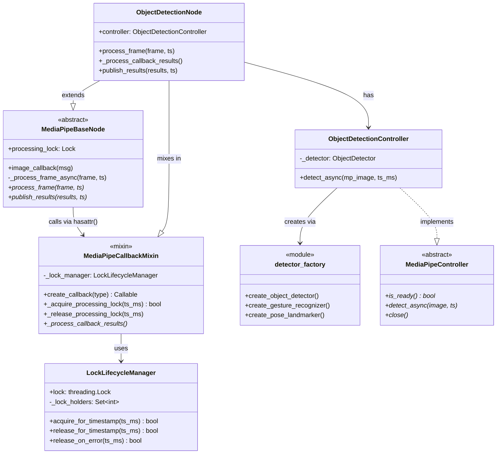
```mermaid
classDiagram
    direction TB

    %% Core Layer (Non-ROS)
    class LockLifecycleManager {
        +lock: threading.Lock
        -_lock_holders: Set~int~
        +acquire_for_timestamp(ts_ms) bool
        +release_for_timestamp(ts_ms) bool
        +release_on_error(ts_ms) bool
    }

    class detector_factory {
        <<module>>
        +create_object_detector()
        +create_gesture_recognizer()
        +create_pose_landmarker()
    }

    %% Common Layer (ROS 2 Base)
    class MediaPipeBaseNode {
        <<abstract>>
        +processing_lock: Lock
        +image_callback(msg)
        -_process_frame_async(frame, ts)
        +process_frame(frame, ts)*
        +publish_results(results, ts)*
    }

    class MediaPipeCallbackMixin {
        <<mixin>>
        -_lock_manager: LockLifecycleManager
        +create_callback(type) Callable
        +_acquire_processing_lock(ts_ms) bool
        +_release_processing_lock(ts_ms)
        +_process_callback_results()*
    }

    %% Controller Layer
    class MediaPipeController {
        <<abstract>>
        +is_ready() bool*
        +detect_async(image, ts)*
        +close()*
    }

    class ObjectDetectionController {
        -_detector: ObjectDetector
        +detect_async(mp_image, ts_ms)
    }

    %% Node Layer
    class ObjectDetectionNode {
        +controller: ObjectDetectionController
        +process_frame(frame, ts)
        +_process_callback_results()
        +publish_results(results, ts)
    }

    %% Relationships
    MediaPipeCallbackMixin --> LockLifecycleManager : uses
    ObjectDetectionController --> detector_factory : creates via
    ObjectDetectionController ..|> MediaPipeController : implements
    ObjectDetectionNode --|> MediaPipeBaseNode : extends
    ObjectDetectionNode --|> MediaPipeCallbackMixin : mixes in
    ObjectDetectionNode --> ObjectDetectionController : has
    MediaPipeBaseNode --> MediaPipeCallbackMixin : calls via hasattr()
```

#### ROS 2 Package Structure

The GestureBot workspace contains the following ROS 2 packages:

| Package | Description |
|---------|-------------|
| `ros2_mediapipe` | Vision processing nodes and custom messages (DetectedObjects, HandGesture, PoseLandmarks) |
| `gesturebot` | Application layer with navigation bridges, controllers, and launch files |
| `camera_ros` | C++ camera driver with libcamera integration |
| `create_driver` | iRobot Create 2 driver (from `create_robot` meta-package, uses `libcreate`) |
| `cv_bridge` | OpenCV-ROS 2 image conversion utility |

The `ros2_mediapipe` package is organized into the following layers:

| Layer | Directory | Description |
|-------|-----------|-------------|
| **Core** | `mpipe/core/` | Non-ROS components: `LockLifecycleManager` for thread-safe lock tracking, factory functions for MediaPipe detectors |
| **Common** | `mpipe/common/` | ROS 2 base classes: `MediaPipeBaseNode` provides threading, `MediaPipeCallbackMixin` provides callback chain |
| **Controller** | `mpipe/controllers/` | MediaPipe wrappers implementing `MediaPipeController` interface |
| **Node** | `mpipe/nodes/` | Concrete ROS 2 nodes using multiple inheritance |

#### Control Flow

##### Successful Processing

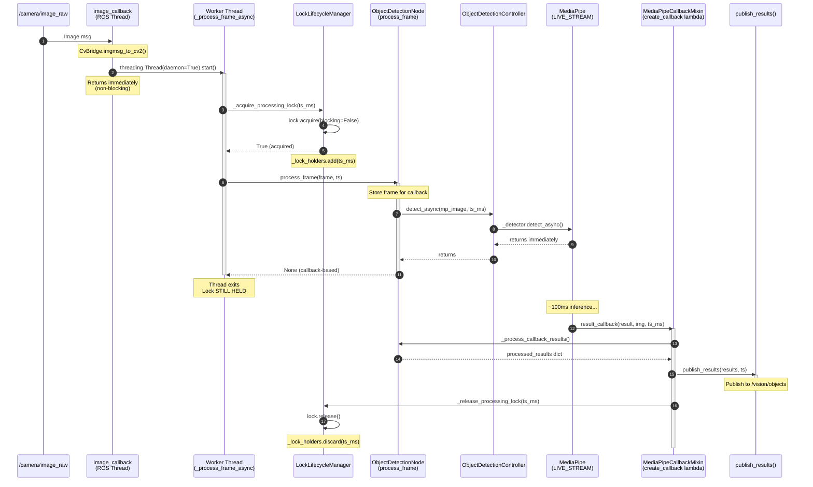
```mermaid
sequenceDiagram
    autonumber
    participant Cam as /camera/image_raw
    participant CB as image_callback<br/>(ROS Thread)
    participant Thr as Worker Thread<br/>(_process_frame_async)
    participant LM as LockLifecycleManager
    participant Node as ObjectDetectionNode<br/>(process_frame)
    participant Ctrl as ObjectDetectionController
    participant MP as MediaPipe<br/>(LIVE_STREAM)
    participant Mix as MediaPipeCallbackMixin<br/>(create_callback lambda)
    participant Pub as publish_results()

    Cam->>CB: Image msg
    Note over CB: CvBridge.imgmsg_to_cv2()
    CB->>Thr: threading.Thread(daemon=True).start()
    activate Thr
    Note over CB: Returns immediately<br/>(non-blocking)

    Thr->>LM: _acquire_processing_lock(ts_ms)
    LM->>LM: lock.acquire(blocking=False)
    LM-->>Thr: True (acquired)
    Note over LM: _lock_holders.add(ts_ms)

    Thr->>Node: process_frame(frame, ts)
    activate Node
    Note over Node: Store frame for callback
    Node->>Ctrl: detect_async(mp_image, ts_ms)
    Ctrl->>MP: _detector.detect_async()
    MP-->>Ctrl: returns immediately
    Ctrl-->>Node: returns
    Node-->>Thr: None (callback-based)
    deactivate Node
    deactivate Thr
    Note over Thr: Thread exits<br/>Lock STILL HELD

    Note over MP: ~100ms inference...

    MP->>Mix: result_callback(result, img, ts_ms)
    activate Mix
    Mix->>Node: _process_callback_results()
    Node-->>Mix: processed_results dict
    Mix->>Pub: publish_results(results, ts)
    activate Pub
    Note over Pub: Publish to /vision/objects
    deactivate Pub
    Mix->>LM: _release_processing_lock(ts_ms)
    LM->>LM: lock.release()
    Note over LM: _lock_holders.discard(ts_ms)
    deactivate Mix
```

**Key Insights:**
- Lock acquired in `_process_frame_async()` but released in MediaPipe callback, covering full inference cycle (~100ms)
- Callback chain: `create_callback()` → `_process_callback_results()` → `publish_results()`
- Worker thread exits after `detect_async()` returns, but lock remains held until callback fires

##### Frame Dropping

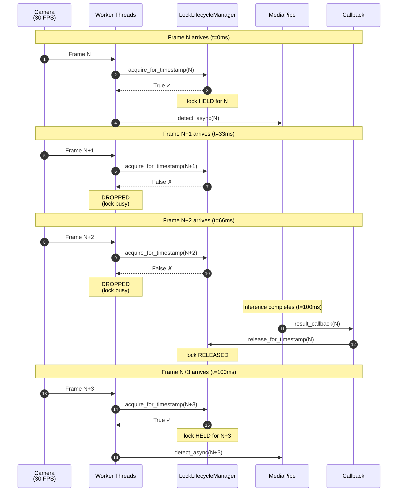
```mermaid
sequenceDiagram
    autonumber
    participant Cam as Camera<br/>(30 FPS)
    participant Thr as Worker Threads
    participant LM as LockLifecycleManager
    participant MP as MediaPipe
    participant Mix as Callback

    Note over Cam,Mix: Frame N arrives (t=0ms)
    Cam->>Thr: Frame N
    Thr->>LM: acquire_for_timestamp(N)
    LM-->>Thr: True ✓
    Note over LM: lock HELD for N
    Thr->>MP: detect_async(N)

    Note over Cam,Mix: Frame N+1 arrives (t=33ms)
    Cam->>Thr: Frame N+1
    Thr->>LM: acquire_for_timestamp(N+1)
    LM-->>Thr: False ✗
    Note over Thr: DROPPED<br/>(lock busy)

    Note over Cam,Mix: Frame N+2 arrives (t=66ms)
    Cam->>Thr: Frame N+2
    Thr->>LM: acquire_for_timestamp(N+2)
    LM-->>Thr: False ✗
    Note over Thr: DROPPED<br/>(lock busy)

    Note over MP: Inference completes (t=100ms)
    MP->>Mix: result_callback(N)
    Mix->>LM: release_for_timestamp(N)
    Note over LM: lock RELEASED

    Note over Cam,Mix: Frame N+3 arrives (t=100ms)
    Cam->>Thr: Frame N+3
    Thr->>LM: acquire_for_timestamp(N+3)
    LM-->>Thr: True ✓
    Note over LM: lock HELD for N+3
    Thr->>MP: detect_async(N+3)
```

**Frame Dropping Details:**
- At 30 FPS, frames arrive every ~33ms, but inference takes ~100ms
- Frames arriving while lock is held fail `acquire(blocking=False)` and are discarded
- Expected drop rate: ~67-75% at 30 FPS input with ~100ms inference time
- `LockLifecycleManager` tracks which timestamp holds the lock via `_lock_holders` set

---

## 2. Object Detection

| *Screen display* | *Click to watch on YouTube* |
|:---------------------:|:---------------------:|
| 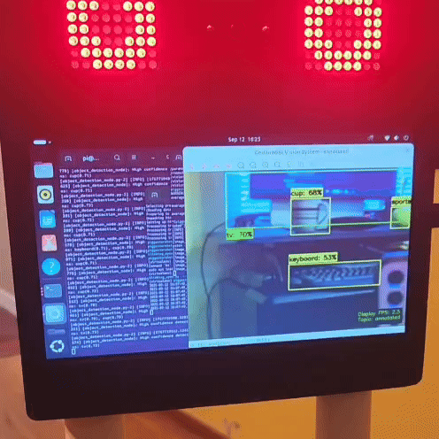 | [](https://youtu.be/_qbPXN9j0Wc) |
| *Screen display* | *Click to watch on YouTube* |

#### Data Flow: Object Detection → Person Following

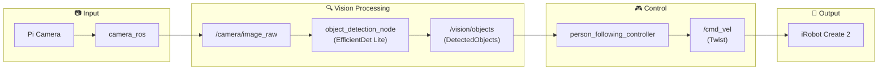
```mermaid
flowchart LR
    subgraph INPUT["📷 Input"]
        CAM["Pi Camera"]
        CAMROS["camera_ros"]
    end

    subgraph VISION["🔍 Vision Processing"]
        TOPIC1["/camera/image_raw"]
        OBJ["object_detection_node<br/>(EfficientDet Lite)"]
        TOPIC2["/vision/objects<br/>(DetectedObjects)"]
    end

    subgraph CONTROL["🎮 Control"]
        FOLLOW["person_following_controller"]
        TOPIC3["/cmd_vel<br/>(Twist)"]
    end

    subgraph OUTPUT["🤖 Output"]
        ROBOT["iRobot Create 2"]
    end

    CAM --> CAMROS --> TOPIC1 --> OBJ --> TOPIC2 --> FOLLOW --> TOPIC3 --> ROBOT
```
1. **Camera Capture**: Pi Camera captures frames via `camera_ros` node
2. **Image Publishing**: Raw images published to `/camera/image_raw` topic
3. **Object Detection**: `object_detection_node` processes frames using EfficientDet Lite model
4. **Detection Results**: Detected objects (especially "person" class) published to `/vision/objects`
5. **Person Following**: `person_following_controller` subscribes to detections and calculates approach velocity
6. **Motion Commands**: Twist messages published to `/cmd_vel` for smooth person tracking

#### Model Architecture

**EfficientDet-Lite** is a single-shot object detector optimized for edge devices:

```
Input Image (320×320×3 RGB)
         ↓
┌─────────────────────────────┐
│  EfficientNet-Lite Backbone │  ← Feature extraction (ImageNet pretrained)
└─────────────────────────────┘
         ↓
┌─────────────────────────────┐
│   BiFPN Feature Pyramid     │  ← Multi-scale feature fusion
└─────────────────────────────┘
         ↓
┌─────────────────────────────┐
│  Class + Box Prediction     │  ← Per-anchor predictions
└─────────────────────────────┘
         ↓
Output: Bounding boxes + Class labels + Confidence scores
```

- **Architecture**: Single-shot detector (no region proposal stage)
- **Backbone**: EfficientNet-Lite (MobileNet-inspired, optimized for mobile)
- **Input Shape**: 320×320×3 (Lite0) or 448×448×3 (Lite2)
- **Output**: Up to N bounding boxes with 80 COCO class probabilities
- **Classes**: 80 COCO categories including person, vehicle, animal, furniture, electronics

#### Model Variants & Quantization

**Available Models:**

| Model | Input Size | Quantization | File Size | CPU Latency* | GPU Latency* | Accuracy (mAP) |
|-------|------------|--------------|-----------|--------------|--------------|----------------|
| EfficientDet-Lite0 | 320×320 | int8 | ~4.4 MB | 29 ms | 24 ms | 29.9% |
| EfficientDet-Lite0 | 320×320 | float16 | ~6.9 MB | 54 ms | 28 ms | 30.0% |
| EfficientDet-Lite0 | 320×320 | float32 | ~13 MB | 54 ms | 28 ms | 30.0% |
| EfficientDet-Lite2 | 448×448 | int8 | ~7.2 MB | 89 ms | 35 ms | 36.0% |
| EfficientDet-Lite2 | 448×448 | float16 | ~11 MB | 198 ms | 47 ms | 36.2% |
| SSD MobileNetV2 | 256×256 | int8 | ~3.6 MB | 24 ms | — | 22.4% |
| SSD MobileNetV2 | 256×256 | float32 | ~14 MB | 31 ms | — | 22.6% |

*Benchmarks from Google AI Edge documentation (Pixel 6 CPU/GPU)

**Quantization Trade-offs:**

| Type | Precision | Size Reduction | Speed | GPU Support | Use Case |
|------|-----------|----------------|-------|-------------|----------|
| **int8** | 8-bit integer | ~75% smaller | Fastest on CPU | Limited | Battery-constrained, edge devices |
| **float16** | 16-bit float | ~50% smaller | Fast | Yes | Balanced performance/accuracy |
| **float32** | 32-bit float | Baseline | Baseline | Yes | Maximum accuracy, development |

**Raspberry Pi 5 Recommendation:** Use **EfficientDet-Lite0 float16** for the best balance of accuracy and performance. The int8 variant offers faster CPU inference but may have compatibility issues with some TFLite delegates.

#### Model Performance

Object detection accuracy is evaluated using **COCO-style mAP** (mean Average Precision), the standard metric for bounding box detection tasks.

**Evaluation Process:**
1. **Run Inference**: Process all test images and collect predictions (bounding boxes, class labels, confidence scores)
2. **Match Predictions to Ground Truth (per class, per image)**: For each image and each class, compute IoU between all predictions and all ground truth boxes of that class
3. **Determine True Positives**: A prediction is TP if IoU ≥ threshold with an unmatched ground truth box; each GT box can only be matched once (highest IoU prediction wins)
4. **Build Global Precision-Recall Curve**: For each class, pool all predictions across all images, sort by confidence (descending), then compute cumulative TP/FP counts to get precision and recall at each rank
5. **Compute AP per Class**: Interpolate precision at 101 recall thresholds (0.00, 0.01, ..., 1.00); AP = mean of these 101 precision values
6. **Average Across Classes**: mAP = mean of AP values for all classes with ground truth instances

##### Model Comparison Summary

*Benchmarked on Raspberry Pi 5. Evaluated on 50 COCO validation images.*

| Model | Quant | mAP@0.50 | mAP@0.50:0.95 | mAP@0.75 | Recall | Latency (ms) | FPS |
|-------|-------|----------|---------------|----------|--------|--------------|-----|
| EfficientDet-Lite0 | int8 | **0.426** | 0.302 | 0.317 | 0.311 | **52.5** | **19.1** |
| **EfficientDet-Lite0** | **float16** | **0.416** | **0.314** | **0.349** | **0.326** | **110.9** | **9.0** |
| EfficientDet-Lite0 | float32 | 0.416 | 0.314 | 0.349 | 0.325 | 100.4 | 10.0 |
| EfficientDet-Lite2 | int8 | 0.458 | 0.344 | 0.372 | 0.372 | 143.8 | 7.0 |
| EfficientDet-Lite2 | float16 | **0.477** | **0.364** | **0.380** | 0.374 | 339.6 | 2.9 |
| EfficientDet-Lite2 | float32 | 0.471 | 0.359 | 0.373 | **0.375** | 328.7 | 3.0 |
| SSD MobileNetV2 | float32 | 0.352 | 0.244 | 0.276 | 0.271 | 68.8 | 14.5 |

*Baseline model (EfficientDet-Lite0 float16) in bold. Best values per column also highlighted.*

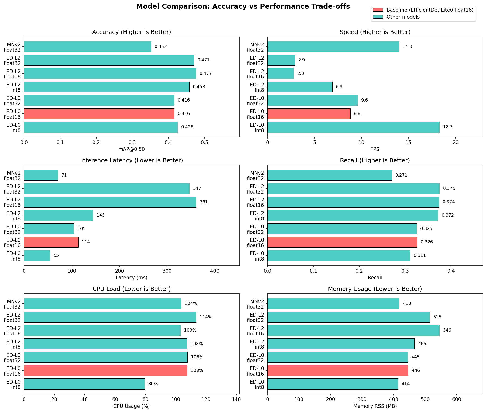

##### Raspberry Pi 5 Recommendation

**Recommended: EfficientDet-Lite0 float16** for GestureBot deployment.

| Model | Accuracy | Speed | Why/Why Not |
|-------|----------|-------|-------------|
| **EfficientDet-Lite0 float16** | mAP=0.416 | 9.0 FPS | ✅ Best balance for person following |
| EfficientDet-Lite0 int8 | mAP=0.426 | 19.1 FPS | Alternative if CPU headroom needed |
| EfficientDet-Lite2 int8 | mAP=0.458 | 7.0 FPS | Consider if accuracy is critical |
| SSD MobileNetV2 float32 | mAP=0.352 | 14.5 FPS | Fastest, but lower accuracy |

**Trade-off Analysis:**

- **EfficientDet-Lite0 int8 vs float16**: int8 provides +112% speed (19.1 vs 9.0 FPS) with +2.4% accuracy improvement (0.426 vs 0.416 mAP). Choose int8 if running additional ROS nodes that need CPU headroom.

- **EfficientDet-Lite2 vs Lite0**: Lite2 int8 offers +10% mAP improvement (0.458 vs 0.416) at cost of -22% detection rate (7.0 vs 9.0 FPS). Consider if detection accuracy is more important than frame rate.

- **SSD MobileNetV2**: Fastest option (14.5 FPS, +61% faster than baseline) but significantly lower accuracy (mAP=0.352, -15%). Only suitable if speed is critical and detection quality can be compromised.

##### Key Findings

1. **EfficientDet-Lite0 int8** is the speed champion at **19.1 FPS** - 2x faster than float16
2. **EfficientDet-Lite0 float16** provides best accuracy/speed balance at **9.0 FPS** with **0.416 mAP**
3. **EfficientDet-Lite2 float16** achieves highest accuracy (**0.477 mAP**) but only **2.9 FPS**
4. **int8 quantization** dramatically improves speed with modest accuracy improvement (~2%)

##### Accuracy

**Key Metrics:**
| Metric | IoU Threshold | Description |
|--------|---------------|-------------|
| mAP@0.50 | 0.50 | PASCAL VOC standard, lenient matching |
| mAP@0.50:0.95 | 0.50 to 0.95 (step 0.05) | COCO primary metric, averaged over 10 thresholds |
| mAP@0.75 | 0.75 | Strict localization requirement |
| Recall@100 | 0.50:0.95 | Max recall with up to 100 detections per image |

**Benchmark Results (EfficientDet-Lite0 float16):**
| Metric | Value |
|--------|-------|
| mAP@0.50 | 0.416 |
| mAP@0.50:0.95 | 0.314 |
| mAP@0.75 | 0.349 |
| Recall@100 | 0.326 |
| Test Images | 50 (COCO val2017 subset) |

##### Precision-Recall Curve

**Precision-Recall Curve (Person Class):**

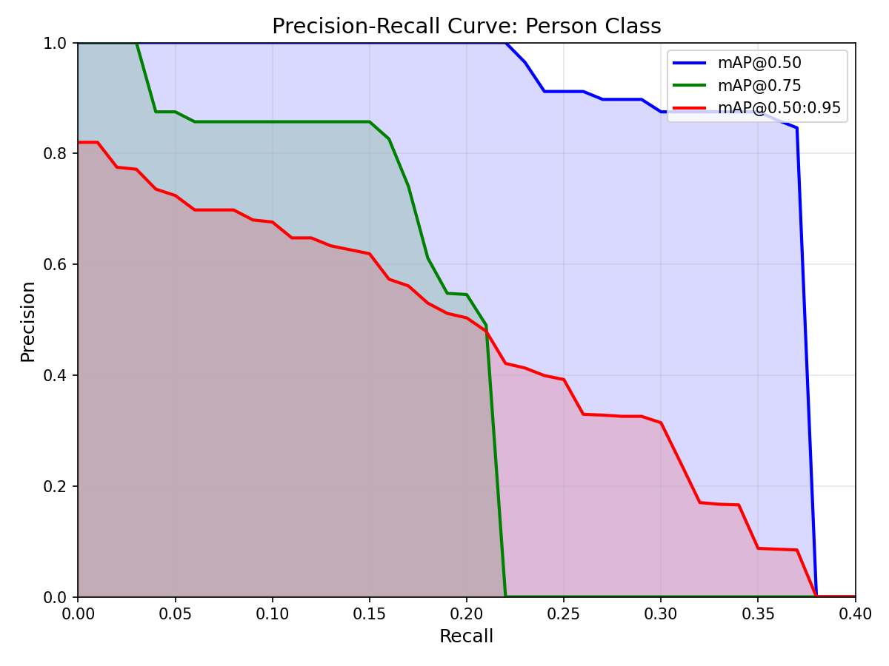

<details>
<summary><strong>Per-Class Precision Tables (click to expand)</strong></summary>

**Per-Class Precision at Recall Thresholds (mAP@0.50)** (Top 10 categories)

| Class | R=0.0 | R=0.1 | R=0.2 | R=0.3 | R=0.4 | R=0.5 | R=0.6 | R=0.7 | R=0.8 | R=0.9 | R=1.0 | AP |
|------|------|------|------|------|------|------|------|------|------|------|------|------|
| person (127) | 1.000 | 1.000 | 1.000 | 0.875 | 0.000 | 0.000 | 0.000 | 0.000 | 0.000 | 0.000 | 0.000 | 0.360 |
| car (34) | 1.000 | 1.000 | 1.000 | 1.000 | 1.000 | 1.000 | 0.947 | 0.000 | 0.000 | 0.000 | 0.000 | 0.622 |
| book (24) | 0.750 | 0.750 | 0.000 | 0.000 | 0.000 | 0.000 | 0.000 | 0.000 | 0.000 | 0.000 | 0.000 | 0.104 |
| boat (15) | 1.000 | 1.000 | 0.000 | 0.000 | 0.000 | 0.000 | 0.000 | 0.000 | 0.000 | 0.000 | 0.000 | 0.139 |
| sheep (13) | 0.000 | 0.000 | 0.000 | 0.000 | 0.000 | 0.000 | 0.000 | 0.000 | 0.000 | 0.000 | 0.000 | 0.000 |
| toilet (13) | 1.000 | 1.000 | 0.600 | 0.000 | 0.000 | 0.000 | 0.000 | 0.000 | 0.000 | 0.000 | 0.000 | 0.206 |
| bird (11) | 1.000 | 1.000 | 1.000 | 1.000 | 1.000 | 1.000 | 1.000 | 0.000 | 0.000 | 0.000 | 0.000 | 0.634 |
| elephant (11) | 1.000 | 1.000 | 1.000 | 1.000 | 1.000 | 1.000 | 0.000 | 0.000 | 0.000 | 0.000 | 0.000 | 0.505 |
| motorcycle (10) | 1.000 | 1.000 | 1.000 | 0.000 | 0.000 | 0.000 | 0.000 | 0.000 | 0.000 | 0.000 | 0.000 | 0.277 |
| orange (10) | 0.000 | 0.000 | 0.000 | 0.000 | 0.000 | 0.000 | 0.000 | 0.000 | 0.000 | 0.000 | 0.000 | 0.000 |


**Per-Class Precision at Recall Thresholds (mAP@0.50:0.95)** (Top 10 categories)

| Class | R=0.0 | R=0.1 | R=0.2 | R=0.3 | R=0.4 | R=0.5 | R=0.6 | R=0.7 | R=0.8 | R=0.9 | R=1.0 | AP |
|------|------|------|------|------|------|------|------|------|------|------|------|------|
| person (127) | 0.820 | 0.676 | 0.503 | 0.314 | 0.000 | 0.000 | 0.000 | 0.000 | 0.000 | 0.000 | 0.000 | 0.185 |
| car (34) | 1.000 | 0.923 | 0.771 | 0.648 | 0.575 | 0.488 | 0.379 | 0.000 | 0.000 | 0.000 | 0.000 | 0.417 |
| book (24) | 0.450 | 0.300 | 0.000 | 0.000 | 0.000 | 0.000 | 0.000 | 0.000 | 0.000 | 0.000 | 0.000 | 0.049 |
| boat (15) | 0.850 | 0.800 | 0.000 | 0.000 | 0.000 | 0.000 | 0.000 | 0.000 | 0.000 | 0.000 | 0.000 | 0.114 |
| sheep (13) | 0.000 | 0.000 | 0.000 | 0.000 | 0.000 | 0.000 | 0.000 | 0.000 | 0.000 | 0.000 | 0.000 | 0.000 |
| toilet (13) | 0.900 | 0.500 | 0.180 | 0.000 | 0.000 | 0.000 | 0.000 | 0.000 | 0.000 | 0.000 | 0.000 | 0.125 |
| bird (11) | 0.840 | 0.757 | 0.717 | 0.657 | 0.657 | 0.657 | 0.400 | 0.000 | 0.000 | 0.000 | 0.000 | 0.426 |
| elephant (11) | 1.000 | 0.800 | 0.800 | 0.760 | 0.600 | 0.400 | 0.000 | 0.000 | 0.000 | 0.000 | 0.000 | 0.367 |
| motorcycle (10) | 0.600 | 0.500 | 0.300 | 0.000 | 0.000 | 0.000 | 0.000 | 0.000 | 0.000 | 0.000 | 0.000 | 0.131 |
| orange (10) | 0.000 | 0.000 | 0.000 | 0.000 | 0.000 | 0.000 | 0.000 | 0.000 | 0.000 | 0.000 | 0.000 | 0.000 |

</details>

<details>
<summary><strong>AP Calculation Example: Person Class (mAP@0.50)</strong></summary>

This table shows how Average Precision is calculated by ranking all person detections by confidence, then computing cumulative precision and recall at each rank.

**Ground Truth: 127 person instances | IoU threshold: 0.50**

| Rank | Image ID | Conf  | TP/FP | Cum TP | Cum FP | Precision | Recall |
|------|----------|-------|-------|--------|--------|-----------|--------|
| 1 | 85329 | 0.929 | TP | 1 | 0 | 1.000 | 0.008 |
| 2 | 456496 | 0.878 | TP | 2 | 0 | 1.000 | 0.016 |
| 3 | 308394 | 0.836 | TP | 3 | 0 | 1.000 | 0.024 |
| 4 | 386912 | 0.774 | TP | 4 | 0 | 1.000 | 0.031 |
| 5 | 233771 | 0.768 | TP | 5 | 0 | 1.000 | 0.039 |
| 6 | 463730 | 0.768 | TP | 6 | 0 | 1.000 | 0.047 |
| 7 | 87038 | 0.750 | TP | 7 | 0 | 1.000 | 0.055 |
| 8 | 296649 | 0.749 | TP | 8 | 0 | 1.000 | 0.063 |
| 9 | 252219 | 0.730 | TP | 9 | 0 | 1.000 | 0.071 |
| 10 | 252219 | 0.727 | TP | 10 | 0 | 1.000 | 0.079 |
| 11 | 329323 | 0.710 | TP | 11 | 0 | 1.000 | 0.087 |
| 12 | 329323 | 0.707 | **FP** | 11 | 1 | 0.917 | 0.087 |
| 13 | 87038 | 0.703 | TP | 12 | 1 | 0.923 | 0.094 |
| 14 | 296649 | 0.690 | TP | 13 | 1 | 0.929 | 0.102 |
| 15 | 296649 | 0.687 | TP | 14 | 1 | 0.933 | 0.110 |
| ... | ... | ... | ... | ... | ... | ... | ... |
| 52 | 174482 | 0.319 | FP | 44 | 8 | 0.846 | 0.346 |
| 53 | 491497 | 0.312 | FP | 44 | 9 | 0.830 | 0.346 |
| 54 | 239274 | 0.306 | FP | 44 | 10 | 0.815 | 0.346 |
| 55 | 87038 | 0.303 | FP | 44 | 11 | 0.800 | 0.346 |
| 56 | 239274 | 0.300 | FP | 44 | 12 | 0.786 | 0.346 |

**Summary:**
- Total detections: 56 (44 TP + 12 FP)
- Max Recall achieved: 44/127 = 0.346 (34.6%)
- AP@0.50 = Area under interpolated P-R curve ≈ 0.360

**How AP is calculated:**
1. Sort all detections by confidence (descending)
2. Match each detection to ground truth (IoU ≥ 0.50 → TP, otherwise FP)
3. Compute cumulative precision and recall at each rank
4. AP = mean of interpolated precision at 101 recall thresholds (0.00, 0.01, ..., 1.00)

</details>

#### Configuration Reference

| Parameter | Type | Default | Range | Description |
|-----------|------|---------|-------|-------------|
| `model_path` | string | `"models/efficientdet.tflite"` | Valid path | Path to TFLite model file |
| `confidence_threshold` | float | `0.5` | 0.0–1.0 | Minimum score to accept detection |
| `max_results` | int | `5` | -1 to ∞ | Maximum detections per frame (-1 = unlimited) |
| `frame_skip` | int | `1` | 0 to ∞ | Frames to skip between processing (0 = every frame, 1 = every 2nd, 2 = every 3rd) |
| `category_allowlist` | list | `[]` | COCO labels | Only detect these categories (empty = all) |
| `category_denylist` | list | `[]` | COCO labels | Exclude these categories from detection |

**Launch with Custom Parameters:**
```bash
# Default launch
ros2 launch gesturebot object_detection.launch.py

# With parameter overrides
ros2 launch gesturebot object_detection.launch.py \
    confidence_threshold:=0.5 \
    max_results:=5 \
    frame_skip:=0
```

> **Note:** Camera parameters (frame rate, exposure) are hardcoded in the launch file for optimal Pi 5 performance. See launch file comments for details.

#### Parameter Tuning and Optimization

The object detection pipeline has been systematically characterized for Raspberry Pi 5 through four parameter experiments: camera frame rate, exposure time, frame skip, and confidence threshold. Each experiment measured CPU usage, temperature, detection rate, object count, and confidence to identify optimal parameters for real-time person detection and following applications.

##### Camera Frame Rate

The camera frame rate significantly impacts system performance. The `FrameDurationLimits` parameter in the launch file controls frame timing (in microseconds). Lower values = higher frame rate.

**Benchmark Results (Raspberry Pi 5, 640×480, EfficientDet-Lite0):**

| Frame Rate | FrameDurationLimits | CPU Mean | CPU P95 | Temp Max | Detection Hz | Drop Rate |
|------------|---------------------|----------|---------|----------|--------------|-----------|
| 5 fps | `[200000, 200000]` | 32.5% | 34.5% | 49.4°C | 2.50 Hz | 49.6% |
| **10 fps** | `[100000, 100000]` | 68.1% | 70.7% | 54.9°C | **4.96 Hz** | 48.8% |
| 15 fps | `[66667, 66667]` | 95.5% | 100.5% | 58.2°C | 7.27 Hz | 46.9% |
| 20 fps | `[50000, 50000]` | 78.9% | 79.8% | 55.4°C | 5.05 Hz | 73.6% |

| CPU Usage Comparison | Frame Drop Rate Comparison |
|:--------------------:|:--------------------------:|
| 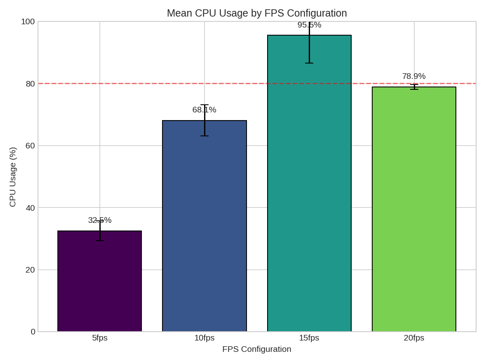 | 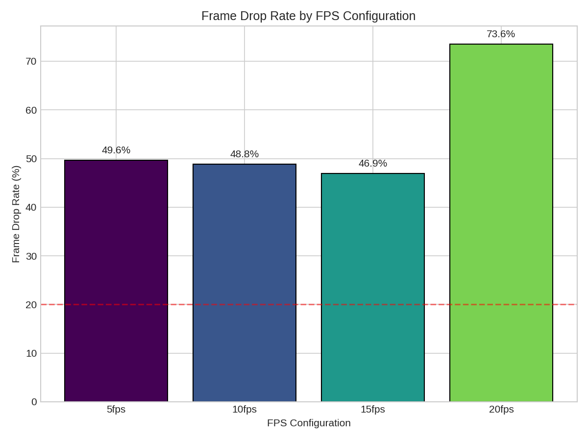 |

**Key Findings:**

| Configuration | Assessment | Rationale |
|---------------|------------|-----------|
| **5 fps** | ❌ Too conservative | Low CPU (32%) but only 2.5 Hz detection rate |
| **10 fps** | ✅ **Recommended** | Best balance: 68% CPU, ~5 Hz detection, stable temperature |
| **15 fps** | ⚠️ CPU saturated | Hits 100% CPU, detection improves to 7.3 Hz but unsustainable |
| **20 fps** | ❌ Counterproductive | Higher input rate causes more frame drops (73.6%), detection drops to 5 Hz |

**Why 10 fps is optimal:**
- **CPU headroom**: 68% average leaves ~30% for other ROS nodes and system tasks
- **Detection throughput**: ~5 Hz detection rate is sufficient for person-following (human movement ~1-2 Hz)
- **Thermal stability**: 55°C max temperature is well within safe operating range
- **Frame efficiency**: Similar drop rate to 5 fps but double the detection output

The optimal configuration is hardcoded in `object_detection.launch.py`:
```python
"FrameDurationLimits": [100000, 100000],  # 10 FPS - optimal for Pi 5
```

##### Camera Exposure Time

The `ExposureTime` parameter controls sensor exposure in microseconds. Tested at 10 FPS (100000μs frame duration):

| Exposure Time | ExposureTime | CPU Mean | Det Hz | Obj Count | Avg Conf | Notes |
|---------------|--------------|----------|--------|-----------|----------|-------|
| 10 ms | `10000` | 67.7% | 4.85 Hz | 1.0 | 0.69 | Darker image |
| 15 ms | `15000` | 66.2% | 4.94 Hz | 1.0 | 0.59 |  |
| **20 ms** | `20000` | 68.4% | 4.75 Hz | **1.7** | **0.67** | **Default** |
| 25 ms | `25000` | 69.1% | 4.98 Hz | 1.8 | 0.63 | Brighter image |
| 30 ms | `30000` | 69.2% | 4.96 Hz | 1.0 | 0.68 | Brighter image |

| Object Detection Count | Detection Confidence |
|:----------------------:|:--------------------:|
| 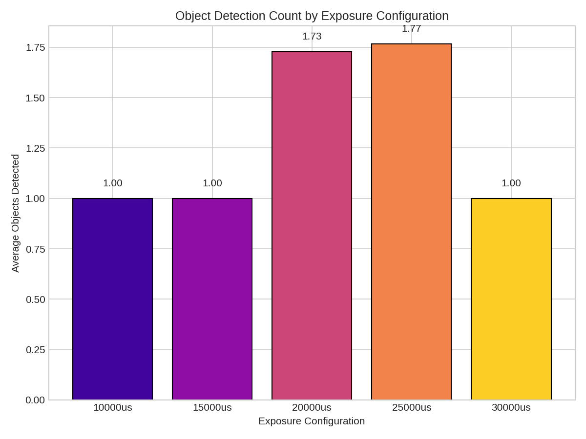 | 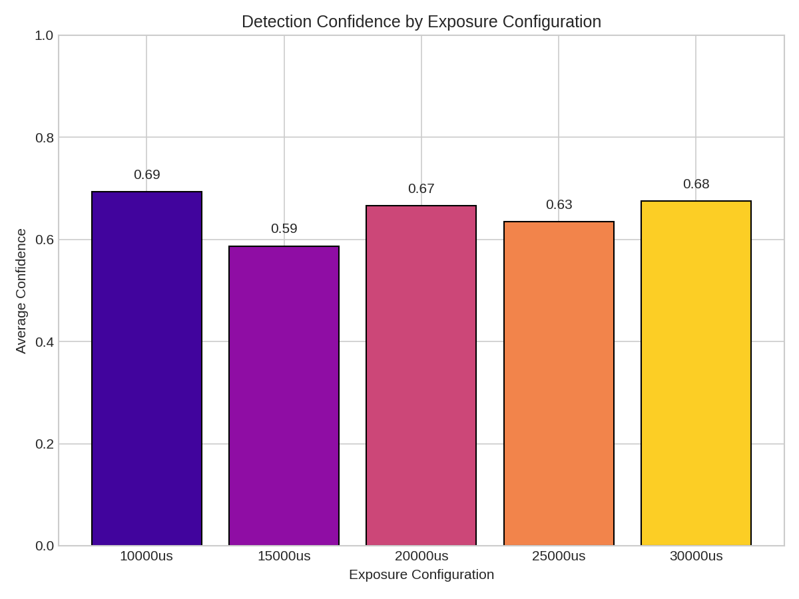 |

**Key Findings:**
- **CPU usage is stable** across all exposure times (~66-69%)
- **Object detection count peaks at 20-25ms** exposure (1.7-1.8 objects vs 1.0 at extremes)
- **Confidence is relatively stable** (0.59-0.69) with slight dip at 15ms
- **20ms (default) is optimal** for indoor lighting: best balance of object detection and confidence

The optimal configuration is hardcoded in `object_detection.launch.py`:
```python
"ExposureTime": 20000,  # 20ms - optimal for indoor lighting
```

##### Frame Skip

The `frame_skip` parameter controls how many camera frames are skipped between processing cycles. Higher values reduce CPU load but decrease detection responsiveness.

| frame_skip | Processing | CPU Mean | CPU P95 | Det Hz | Obj Count | Avg Conf | Notes |
|------------|------------|----------|---------|--------|-----------|----------|-------|
| **0** | All frames | 70.5% | 72.4% | 4.98 Hz | 1.0 | 0.55 | **Default** |
| 1 | Every 2nd frame | 66.7% | 69.9% | 4.73 Hz | 1.0 | 0.56 |  |
| 2 | Every 3rd frame | 45.9% | 48.0% | 3.29 Hz | 1.0 | 0.56 |  |
| 3 | Every 4th frame | 35.9% | 36.8% | 2.47 Hz | 1.0 | 0.57 | Max CPU savings |

| CPU Comparison | Detection Rate |
|:--------------:|:--------------:|
| 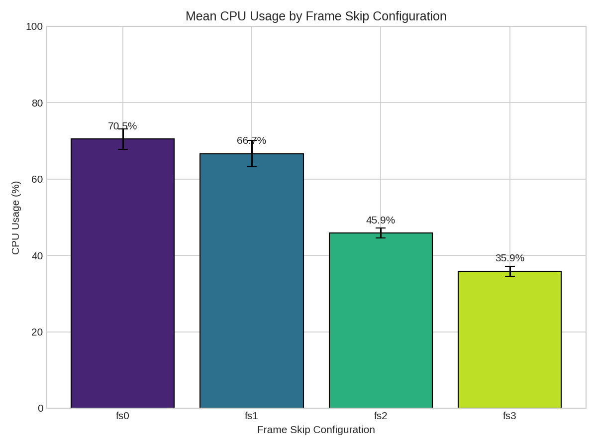 | 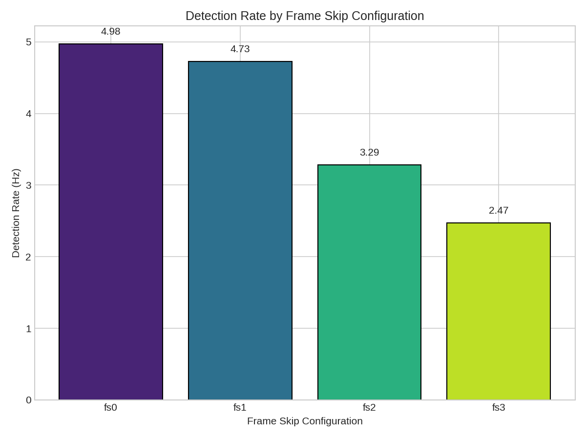 |

**Key Findings:**
- **CPU usage scales linearly** with frame_skip: 70% (fs0) → 67% (fs1) → 46% (fs2) → 36% (fs3)
- **Detection rate decreases proportionally**: 5 Hz → 4.7 Hz → 3.3 Hz → 2.5 Hz
- **Detection quality (confidence) remains stable** across all frame_skip values (~0.55-0.57)
- **70% CPU usage leaves ~30% headroom** for other processes on Raspberry Pi 5
- **Built-in frame drop protection**: The threading pattern with lock mechanism handles overload gracefully

**Recommendations:**
- **Person following**: Use `frame_skip=0` (default) for maximum detection responsiveness (~5 Hz)
- **Static object detection**: `frame_skip=2` or `3` acceptable for slower-moving scenarios
- **CPU-constrained systems**: Increase `frame_skip` to free CPU for other nodes

The optimal configuration is hardcoded in `object_detection.launch.py`:
```python
"frame_skip": 0,  # Process all frames - maximum detection responsiveness
```

##### Confidence Threshold

The `confidence_threshold` parameter filters detections post-inference. Tested at 10 FPS, 20ms exposure, frame_skip=0:

| Threshold | CPU Mean | Det Hz | Obj Count | Avg Conf | Det Rate | Notes |
|-----------|----------|--------|-----------|----------|----------|-------|
| 0.3 | 64.8% | 5.00 Hz | 4.0 | 0.48 | 100% | More false positives |
| 0.4 | 62.8% | 5.00 Hz | 3.2 | 0.50 | 100% |  |
| **0.5** | 63.5% | 5.00 Hz | 1.6 | 0.55 | 100% | **Default** |
| 0.6 | 62.5% | 3.06 Hz | 1.0 | 0.61 | 100% |  |
| 0.7 | 63.2% | N/A | N/A | N/A | N/A | May miss valid detections |

| Object Count | Detection Hz |
|:------------:|:------------:|
| 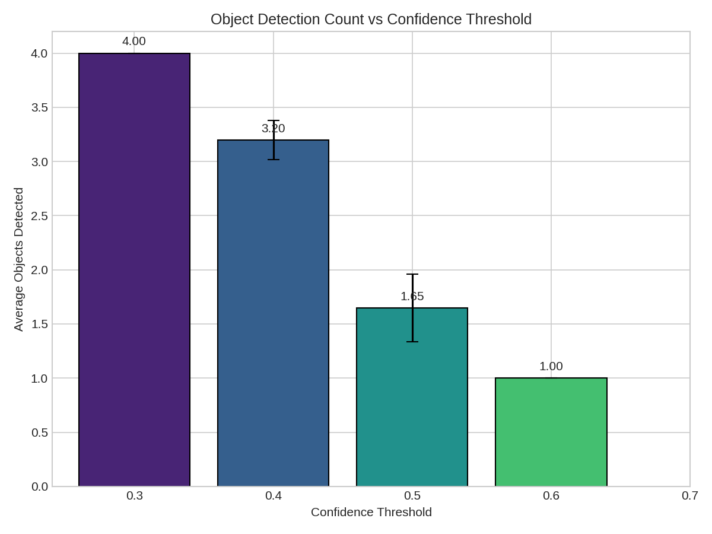 | 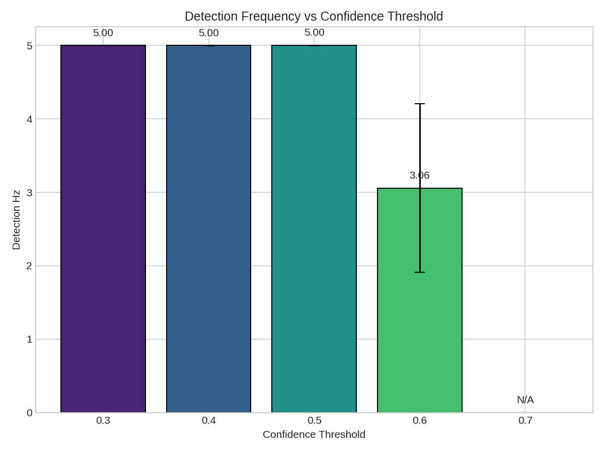 |

**Key Findings:**
- **CPU impact is minimal** - Threshold filtering occurs post-inference
- **Lower thresholds (0.3-0.4)** detect more objects but include false positives
- **Higher thresholds (0.6+)** reduce detection rate as fewer detections pass the filter
- **0.7 threshold too aggressive** - No detections passed for test scene (cup at ~0.55-0.61 confidence)

**Recommendations:**
- **General use**: Keep `confidence_threshold=0.5` (default) for balanced sensitivity/precision
- **Noisy environments**: Increase to `0.6` to reduce false positives
- **High recall needed**: Lower to `0.3-0.4` but expect more false detections

#### System Performance - Latency/CPU/Memory

This section summarizes the performance characteristics of the object detection pipeline (EfficientDet-Lite0 float16) on Raspberry Pi 5 using the recommended configuration.

##### Latency Characterization

| Metric | Value | Notes |
|--------|-------|-------|
| **Model Inference** | 110.9 ms | Pure inference time (excludes preprocessing) |
| **Theoretical FPS** | 9.0 | Based on inference latency only |
| **End-to-End Detection Rate** | ~5 Hz | Real-world with 10 FPS camera input |

**End-to-End Pipeline Latency:**

| Pipeline Stage | Typical Latency |
|----------------|-----------------|
| Camera Capture | 100 ms (10 FPS) |
| Image Conversion (cv_bridge) | <5 ms |
| Model Inference | 111 ms |
| Result Publishing | <1 ms |
| **Total Pipeline** | **~200 ms** |

##### Resource Utilization

Measured during sustained operation at 10 FPS camera input (recommended configuration):

| Resource | Value | Notes |
|----------|-------|-------|
| **CPU Usage (Mean)** | 68.1% | Leaves ~30% headroom for other ROS nodes |
| **CPU Usage (P95)** | 70.7% | Peak usage during detection bursts |
| **Memory (RSS)** | ~350 MB | Object detection node process |
| **Temperature (Max)** | 54.9°C | Well below 85°C throttle threshold |
| **Frame Drop Rate** | 48.8% | Expected due to async processing |

**Thermal Considerations:**
- Pi 5 throttles at 85°C; measured max of 54.9°C provides 30°C headroom
- Active cooling recommended for sustained operation
- Passive cooling sufficient at lower frame rates (<5 FPS)

---

## 3. Gesture Recognition

Real-time hand gesture recognition using MediaPipe, detecting 7 gesture classes (Closed_Fist, Open_Palm, Pointing_Up, Thumb_Down, Thumb_Up, Victory, ILoveYou) with 21-point hand landmarks for robot control.

| *Screen recording* | *Click to watch on YouTube* |
|:---------------------:|:---------------------:|
| 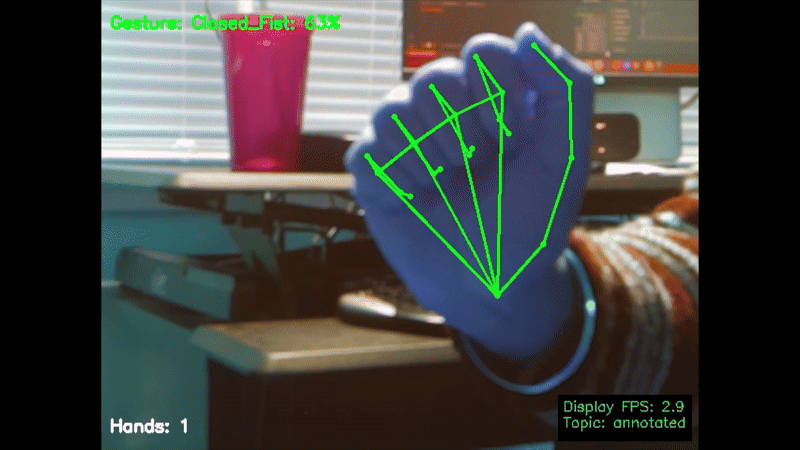 | [](https://youtu.be/ttKg7M3_JEA) |
| *Hand landmarks and gesture classification* | *Full demonstration video* |

- **Model**: MediaPipe Gesture Recognizer (gesture_recognizer.task)
- **Hand Landmarks**: 21-point hand skeleton with connections
- **Dual Hand Support**: Track up to 2 hands simultaneously
- **Confidence Threshold**: 0.5 (configurable)
- **Performance**: Real-time processing @ 640x480 with BGR888 format

#### Data Flow: Gesture Recognition → Navigation

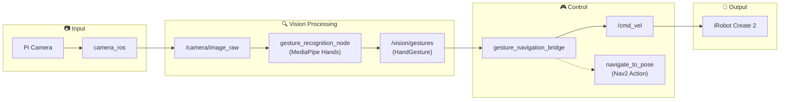
```mermaid
flowchart LR
    subgraph INPUT["📷 Input"]
        CAM["Pi Camera"]
        CAMROS["camera_ros"]
    end

    subgraph VISION["🔍 Vision Processing"]
        TOPIC1["/camera/image_raw"]
        GES["gesture_recognition_node<br/>(MediaPipe Hands)"]
        TOPIC2["/vision/gestures<br/>(HandGesture)"]
    end

    subgraph CONTROL["🎮 Control"]
        GNAV["gesture_navigation_bridge"]
        TOPIC3["/cmd_vel"]
        NAV2["navigate_to_pose<br/>(Nav2 Action)"]
    end

    subgraph OUTPUT["🤖 Output"]
        ROBOT["iRobot Create 2"]
    end

    CAM --> CAMROS --> TOPIC1 --> GES --> TOPIC2 --> GNAV
    GNAV --> TOPIC3 --> ROBOT
    GNAV -.-> NAV2
```

**Data Flow Description:**
1. **Camera Capture**: Pi Camera captures frames via `camera_ros` node
2. **Image Publishing**: Raw images published to `/camera/image_raw` topic
3. **Gesture Recognition**: `gesture_recognition_node` detects hand landmarks and classifies gestures
4. **Gesture Results**: Recognized gestures published to `/vision/gestures` with confidence scores
5. **Navigation Bridge**: `gesture_navigation_bridge` maps gestures to navigation commands
6. **Motion Commands**: Direct velocity commands to `/cmd_vel` or goal-based navigation via Nav2


<!-- Complete hand landmarks visualization with 21 points and skeleton connections -->

#### Model Architecture

**MediaPipe Gesture Recognizer** uses a multi-stage pipeline bundled in a single `.task` file:

```
Input Image (variable size)
         ↓
┌─────────────────────────────┐
│   Palm Detection Model      │  ← BlazePalm: Locates hands in frame
│   (Single-shot detector)    │     Returns palm bounding box + 7 keypoints
└─────────────────────────────┘
         ↓
┌─────────────────────────────┐
│   Hand Landmark Model       │  ← Extracts 21 3D landmarks per hand
│   (Cropped hand region)     │     Input: 224×224 cropped hand image
└─────────────────────────────┘
         ↓
┌─────────────────────────────┐
│   Gesture Embedding Model   │  ← Converts landmarks to feature vector
└─────────────────────────────┘
         ↓
┌─────────────────────────────┐
│   Gesture Classifier        │  ← 7-class classification head
└─────────────────────────────┘
         ↓
Output: Gesture label + Confidence + 21 hand landmarks + Handedness
```

**Pipeline Details:**
- **Palm Detection (BlazePalm)**: Single-shot detector that locates hands using palm regions (more reliable than full hand detection due to consistent palm shape)
- **Hand Landmarks**: 21 3D keypoints per hand (wrist, thumb CMC/MCP/IP/TIP, index MCP/PIP/DIP/TIP, etc.)
- **Landmark Format**: Normalized coordinates (x, y in [0,1] relative to image, z represents depth relative to wrist)
- **Tracking Optimization**: In VIDEO/LIVE_STREAM modes, uses previous frame landmarks to skip palm detection when `min_hand_presence_confidence` threshold is met
- **Handedness Detection**: Classifies each hand as "Left" or "Right" with confidence score

**Built-in Gestures (7 total):**

| Gesture | Internal Name | Description |
|---------|---------------|-------------|
| 👊 | `Closed_Fist` | All fingers closed |
| 🖐️ | `Open_Palm` | All fingers extended |
| ☝️ | `Pointing_Up` | Index finger extended upward |
| 👎 | `Thumb_Down` | Thumb pointing down |
| 👍 | `Thumb_Up` | Thumb pointing up |
| ✌️ | `Victory` | Index and middle fingers extended |
| 🤟 | `ILoveYou` | Thumb, index, and pinky extended |

#### Model Variants & Quantization

**Single Model Variant:**

Unlike object detection (which offers multiple EfficientDet variants), MediaPipe provides only one gesture recognizer model: `gesture_recognizer.task`. This bundle contains all required sub-models:

| Sub-Model | Purpose | Input Size |
|-----------|---------|------------|
| BlazePalm | Palm detection | Full image (variable) |
| HandLandmarker | 21-point landmark extraction | 224×224 (cropped hand) |
| Gesture Embedding | Feature extraction from landmarks | 21 landmarks |
| Gesture Classifier | 7-class classification | Embedding vector |

**Quantization:**

| Component | Quantization | Notes |
|-----------|--------------|-------|
| Palm Detector | float16 | Optimized for mobile GPU |
| Hand Landmarker | float16 | 21-point 3D landmark regression |
| Gesture Classifier | float16 | 7-class classification head |

**Reference Benchmark (Pixel 6):**
- CPU Latency: 16.76 ms (~60 FPS theoretical)
- GPU Latency: 20.87 ms (~48 FPS theoretical)

**Note:** Unlike object detection, MediaPipe does not provide int8 quantized gesture models or multiple model sizes. The float16 models are already optimized for edge deployment.

#### Model Performance

Gesture recognition is a **per-frame classification task** where the model predicts a gesture class for each detected hand. Unlike object detection, there is no spatial localization to evaluate—only whether the predicted gesture matches the ground truth.

**Primary Metrics:**
| Metric | Description |
|--------|-------------|
| Top-1 Accuracy | Percentage of frames where predicted gesture = ground truth |
| Confusion Matrix | Per-class prediction breakdown showing common misclassifications |
| F1-Score | Harmonic mean of precision and recall per gesture class |

**Why mAP Doesn't Apply:**
- No bounding boxes to match (hand detection is separate from gesture classification)
- Single-label classification per hand, not multi-object detection
- No IoU-based matching required

**Supported Gestures (Internal Names):**
- `Closed_Fist`, `Open_Palm`, `Pointing_Up`, `Thumb_Down`, `Thumb_Up`, `Victory`, `ILoveYou`

**Note:** The model also outputs `None` when no recognizable gesture is detected.

#### Configuration Reference

**ROS 2 Node Parameters:**

| Parameter | Type | Default | Range | Description |
|-----------|------|---------|-------|-------------|
| `model_path` | string | `"models/gesture_recognizer.task"` | Valid path | Path to gesture recognizer task bundle |
| `confidence_threshold` | float | `0.7` | 0.0–1.0 | Minimum confidence for hand detection (maps to `min_hand_detection_confidence`) |
| `max_hands` | int | `2` | 1–4 | Maximum hands to detect simultaneously |
| `frame_skip` | int | `1` | 0 to ∞ | Frames to skip between processing (0 = every frame, 1 = every 2nd) |
| `log_level` | string | `"INFO"` | DEBUG, INFO, WARN, ERROR | Logging verbosity level |
| `debug_mode` | bool | `false` | true/false | Enable verbose debug output (deprecated, use log_level) |

**MediaPipe Internal Parameters (hardcoded in controller):**

| Parameter | Value | Description |
|-----------|-------|-------------|
| `min_hand_presence_confidence` | `0.5` | Minimum confidence that hand exists in ROI |
| `min_tracking_confidence` | `0.5` | Minimum confidence to track vs re-detect |

**Launch with Custom Parameters:**
```bash
# Default launch (uses 0.7 confidence threshold for safety)
ros2 launch gesturebot gesture_recognition.launch.py

# With parameter overrides
ros2 launch gesturebot gesture_recognition.launch.py \
    max_hands:=1 \
    confidence_threshold:=0.5 \
    debug_mode:=true
```

**Why 0.7 instead of 0.5?** GestureBot uses a higher confidence threshold (0.7) to reduce false positive gestures that could trigger unintended navigation commands. This is more conservative but prevents accidental robot movements.

#### System Performance - Latency/CPU/Memory

This section summarizes the performance characteristics of the gesture recognition pipeline on Raspberry Pi 5 using the recommended configuration (640×480, 15 FPS camera input, confidence threshold 0.5).

##### Latency Characterization

| Metric | Value | Notes |
|--------|-------|-------|
| **Mean Latency** | 68.5 ms | End-to-end frame processing time |
| **P95 Latency** | 71.7 ms | 95th percentile latency |
| **P99 Latency** | 73.3 ms | 99th percentile latency |
| **Mean FPS** | 14.6 | Sustained processing rate |
| **Theoretical Max FPS** | ~14.6 | Limited by model inference |

##### Resource Usage

| Metric | Mean | P95 | Max | Notes |
|--------|------|-----|-----|-------|
| **CPU Usage** | 111.2% | 119.5% | 129.4% | Multi-core utilization |
| **Memory** | 215.3 MB | 216.0 MB | 216.0 MB | Stable allocation |
| **Temperature** | 56.2°C | 58.4°C | 59.5°C | With passive cooling |

##### Per-Gesture Accuracy

Benchmark results from interactive testing with 10 seconds per gesture (936 total frames):

| Gesture | Accuracy | Detection Rate | FPS | Latency (ms) |
|---------|----------|----------------|-----|--------------|
| 👊 Closed_Fist | 83.8% | 83.8% | 15.2 | 65.7 |
| 🖐️ Open_Palm | 80.2% | 90.8% | 14.2 | 70.2 |
| ☝️ Pointing_Up | 80.2% | 92.4% | 14.2 | 70.3 |
| 👎 Thumb_Down | 70.7% | 79.3% | 15.3 | 65.5 |
| 👍 Thumb_Up | 86.4% | 97.7% | 14.3 | 70.0 |
| ✌️ Victory | 80.7% | 90.4% | 14.7 | 67.9 |
| 🤟 ILoveYou | 84.7% | 95.4% | 14.3 | 70.1 |
| **Overall** | **80.9%** | **89.9%** | **14.6** | **68.5** |

**Key Observations:**
- **Best performing gestures**: Thumb_Up (86.4%), ILoveYou (84.7%), Closed_Fist (83.8%)
- **Most challenging gesture**: Thumb_Down (70.7%) - often confused with similar hand positions
- **Detection rate vs accuracy gap**: Open_Palm has high detection (90.8%) but lower accuracy (80.2%), indicating occasional misclassification

##### Comparison: Gesture vs Object Detection

| Metric | Gesture Recognition | Object Detection (EfficientDet-Lite0) |
|--------|---------------------|---------------------------------------|
| Mean Latency | 68.5 ms | 110.9 ms |
| Mean FPS | 14.6 | 9.0 |
| CPU Usage (mean) | 111.2% | 68.1% |
| Memory Usage | 215 MB | 206 MB |
| Max Temperature | 59.5°C | 54.9°C |

**Analysis:** Gesture recognition achieves higher FPS due to the lighter-weight hand landmark model, but consumes more CPU due to the multi-stage pipeline (palm detection → hand landmarks → gesture classification).

---

## 4. Pose Detection

Real-time body pose detection using MediaPipe, detecting 33 body landmarks with 4-pose navigation system (arms_raised, pointing_left, pointing_right, t_pose) for intuitive robot control through body movements.

| *Screen recording* | *Click to watch on YouTube* |
|:---------------------:|:---------------------:|
| 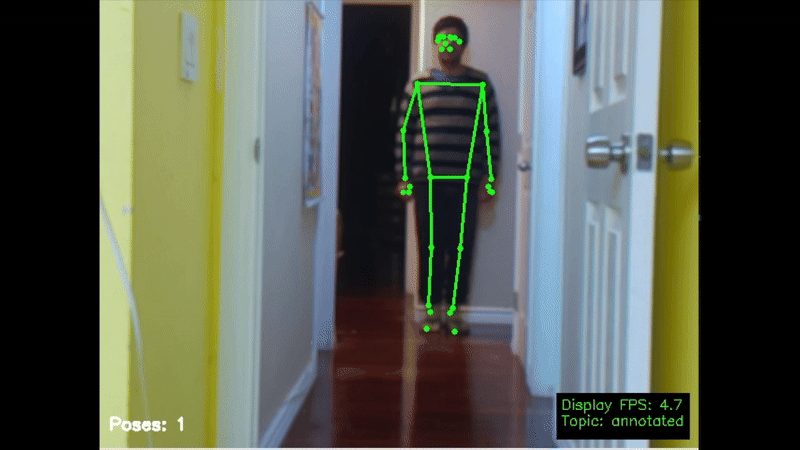 | [](https://youtu.be/eUGK2X6XVN8) |
| *Body landmarks and pose classification* | *Full demonstration video* |

- **Model**: MediaPipe PoseLandmarker (pose_landmarker.task)
- **33 Body Landmarks**: Full body pose detection with skeletal connections
- **Multi-person Support**: Track up to 2 people simultaneously
- **Real-time Performance**: 3-7 FPS @ 640x480 with RGB888 format
- **Headless Operation**: No X11/UI dependencies required

#### Data Flow: Pose Detection → Navigation

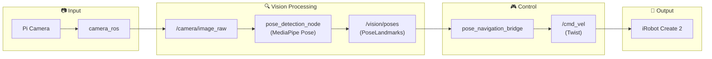
```mermaid
flowchart LR
    subgraph INPUT["📷 Input"]
        CAM["Pi Camera"]
        CAMROS["camera_ros"]
    end

    subgraph VISION["🔍 Vision Processing"]
        TOPIC1["/camera/image_raw"]
        POSE["pose_detection_node<br/>(MediaPipe Pose)"]
        TOPIC2["/vision/poses<br/>(PoseLandmarks)"]
    end

    subgraph CONTROL["🎮 Control"]
        PNAV["pose_navigation_bridge"]
        TOPIC3["/cmd_vel<br/>(Twist)"]
    end

    subgraph OUTPUT["🤖 Output"]
        ROBOT["iRobot Create 2"]
    end

    CAM --> CAMROS --> TOPIC1 --> POSE --> TOPIC2 --> PNAV --> TOPIC3 --> ROBOT
```

**Data Flow Description:**
1. **Camera Capture**: Pi Camera captures frames via `camera_ros` node
2. **Image Publishing**: Raw images published to `/camera/image_raw` topic
3. **Pose Detection**: `pose_detection_node` extracts 33 body landmarks per person
4. **Pose Classification**: Landmarks analyzed to classify into one of 4 navigation poses
5. **Navigation Bridge**: `pose_navigation_bridge` converts classified poses to motion commands
6. **Motion Commands**: Twist messages published to `/cmd_vel` for robot control


<!-- Real-time pose detection with 33-point skeleton visualization -->

**4-Pose Navigation System:**
| Pose | Action | Detection Criteria |
|------|--------|-------------------|
| 🙌 Arms Raised | Move Forward | Both wrists above shoulders |
| 👈 Pointing Left | Turn Left | Left arm extended horizontally |
| 👉 Pointing Right | Turn Right | Right arm extended horizontally |
| 🧍 T-Pose | Stop | Both arms extended horizontally |

#### Model Architecture

**MediaPipe Pose Landmarker** uses a two-stage pipeline based on BlazePose with GHUM 3D human body model integration:

```
Input Image (variable size)
         ↓
┌─────────────────────────────┐
│   Pose Detection Model      │  ← Locates person bounding box
│   (224×224×3 input)         │     Single-shot detector (SSD-style)
└─────────────────────────────┘
         ↓
┌─────────────────────────────┐
│   Pose Landmark Model       │  ← Extracts 33 3D body landmarks
│   (256×256×3 input)         │     BlazePose GHUM topology
└─────────────────────────────┘
         ↓
Output: 33 landmarks (x, y, z, visibility, presence) + optional segmentation mask
```

**Pipeline Details:**

| Stage | Input Size | Output | Purpose |
|-------|------------|--------|---------|
| Pose Detector | 224×224×3 RGB | Person bounding box | Locate person in frame |
| Pose Landmarker | 256×256×3 RGB | 33 3D landmarks | Extract body keypoints |

**Key Architectural Features:**

- **BlazePose Backbone**: Lightweight CNN architecture optimized for mobile/edge inference
- **GHUM 3D Integration**: Landmarks follow the GHUM (Generative 3D Human Shape Model) topology for anatomically consistent 3D coordinates
- **Tracking Optimization**: Uses previous frame landmarks to skip detection stage when person is already tracked, reducing latency by ~50%
- **World Coordinates**: Outputs real-world 3D coordinates (meters) with hip midpoint as origin, in addition to normalized image coordinates

**Output Coordinate Systems:**

| Coordinate Type | Description | Use Case |
|-----------------|-------------|----------|
| **Normalized (x, y)** | 0.0–1.0 relative to image dimensions | 2D overlay, gesture classification |
| **Depth (z)** | Relative depth, hip midpoint as origin | Occlusion handling |
| **World (x, y, z)** | Real-world meters, hip midpoint origin | 3D pose analysis, motion capture |
| **Visibility** | Likelihood landmark is visible (0.0–1.0) | Confidence filtering |
| **Presence** | Likelihood landmark exists (0.0–1.0) | Occlusion detection |

**33 Body Landmarks (GHUM Topology):**

| Index | Landmark | Index | Landmark | Index | Landmark |
|-------|----------|-------|----------|-------|----------|
| 0 | Nose | 11 | Left Shoulder | 23 | Left Hip |
| 1 | Left Eye Inner | 12 | Right Shoulder | 24 | Right Hip |
| 2 | Left Eye | 13 | Left Elbow | 25 | Left Knee |
| 3 | Left Eye Outer | 14 | Right Elbow | 26 | Right Knee |
| 4 | Right Eye Inner | 15 | Left Wrist | 27 | Left Ankle |
| 5 | Right Eye | 16 | Right Wrist | 28 | Right Ankle |
| 6 | Right Eye Outer | 17 | Left Pinky | 29 | Left Heel |
| 7 | Left Ear | 18 | Right Pinky | 30 | Right Heel |
| 8 | Right Ear | 19 | Left Index | 31 | Left Foot Index |
| 9 | Mouth Left | 20 | Right Index | 32 | Right Foot Index |
| 10 | Mouth Right | 21 | Left Thumb | | |
| | | 22 | Right Thumb | | |

**Landmark Groups:**

| Group | Indices | Purpose |
|-------|---------|---------|
| Face | 0–10 | Head orientation, gaze direction |
| Upper Body | 11–22 | Arm gestures, hand positions |
| Lower Body | 23–32 | Leg positions, gait analysis |

#### Model Variants & Quantization

MediaPipe provides three pose landmarker model variants. GestureBot uses the **Lite** variant for optimal real-time performance on Raspberry Pi 5.

**Available Model Variants:**

| Variant | Size | Quantization | Accuracy | Speed | Use Case |
|---------|------|--------------|----------|-------|----------|
| **Lite** | ~3 MB | float16 | Good | Fastest | Real-time on edge devices (Pi 5) |
| Full | ~6 MB | float16 | Better | Medium | Balanced accuracy/performance |
| Heavy | ~26 MB | float16 | Best | Slowest | Maximum accuracy, offline processing |

**Lite Model Details (GestureBot Default):**

| Property | Value |
|----------|-------|
| Model File | `pose_landmarker_lite.task` |
| Download Size | ~3 MB |
| Quantization | float16 (no int8 available) |
| Pose Detector Input | 224×224×3 RGB |
| Pose Landmarker Input | 256×256×3 RGB |
| Output | 33 landmarks with visibility/presence scores |

**Benchmark Comparison (Pixel 6 CPU):**

| Variant | Latency | FPS (theoretical) | Relative Speed |
|---------|---------|-------------------|----------------|
| **Lite** | ~12 ms | ~83 FPS | 1.0× (baseline) |
| Full | ~25 ms | ~40 FPS | 0.48× |
| Heavy | ~108 ms | ~9 FPS | 0.11× |

**Raspberry Pi 5 Performance (Lite Model):**

| Configuration | FPS | Latency | Notes |
|---------------|-----|---------|-------|
| Single pose, no segmentation | 5-8 FPS | 125-200 ms | GestureBot default |
| Single pose, with segmentation | 3-5 FPS | 200-330 ms | Not recommended |
| Multi-pose (2 people) | 3-5 FPS | 200-330 ms | Reduced throughput |

**Why Lite Model for GestureBot:**

1. **Sufficient Accuracy**: The 4-pose navigation system (arms raised, pointing left/right, T-pose) uses large body movements that are reliably detected even with the Lite model
2. **Real-time Performance**: Achieves 5-8 FPS on Pi 5, adequate for responsive robot control
3. **Memory Efficiency**: ~3 MB model size leaves headroom for other ROS 2 nodes
4. **Tracking Optimization**: Frame-to-frame tracking reduces effective latency for continuous pose detection

**Quantization Notes:**

Unlike object detection models (which offer int8 variants), all pose landmarker models use **float16** quantization only. This is because:
- Pose estimation requires higher precision for accurate 3D coordinate regression
- Keypoint localization is more sensitive to quantization errors than bounding box detection
- The float16 format provides a good balance between accuracy and inference speed

**Segmentation Masks (Optional):**

| Property | Value |
|----------|-------|
| Purpose | Pixel-level person segmentation for background removal |
| Performance Impact | +20-30% processing time |
| GestureBot Usage | **Disabled** (not needed for pose-based navigation) |
| Enable via | `output_segmentation_masks: true` parameter |

#### Model Performance

Pose detection accuracy for the 4-pose navigation system is measured as pose classification correctness. Benchmark results from interactive testing on Raspberry Pi 5 (4GB) with Pi Camera Module 3 at 640x480 @ 15fps.

##### Per-Pose Accuracy

| Pose | Accuracy | Detection Rate | FPS | Latency (ms) |
|------|----------|----------------|-----|--------------|
| 🙌 arms_raised | 38.8% | 55.8% | 15.2 | 65.7 |
| 👈 pointing_left | 71.9% | 98.6% | 14.1 | 70.8 |
| 👉 pointing_right | 77.9% | 94.3% | 14.3 | 70.0 |
| 🤸 t_pose | **92.2%** | **100%** | 14.3 | 69.9 |
| **Overall** | **69.8%** | **86.8%** | **14.5** | **69.1** |

##### Accuracy Visualization

```
Pose Classification Accuracy (%)
━━━━━━━━━━━━━━━━━━━━━━━━━━━━━━━━━━━━━━━━━━━━━━━━━━━━━━━━━━━━
arms_raised    ████████████████░░░░░░░░░░░░░░░░░░░░░░░░  38.8%
pointing_left  ████████████████████████████████░░░░░░░░  71.9%
pointing_right ████████████████████████████████████░░░░  77.9%
t_pose         █████████████████████████████████████████  92.2%
━━━━━━━━━━━━━━━━━━━━━━━━━━━━━━━━━━━━━━━━━━━━━━━━━━━━━━━━━━━━
               0%       25%       50%       75%      100%
```

**Key Observations:**
- **Best performing pose**: T-pose (92.2%) — most distinctive with both arms extended
- **Most challenging pose**: arms_raised (38.8%) — sensitive to timing at benchmark start
- **Pointing poses**: 71.9-77.9% accuracy with excellent detection rates (94-99%)
- **Detection rate vs accuracy**: pointing_left has 98.6% detection but 71.9% accuracy, indicating occasional misclassification

##### Pose Classification Logic

The classification uses normalized landmark coordinates with camera mirroring correction:

| Pose | Detection Criteria |
|------|-------------------|
| 🙌 arms_raised | Both wrists above shoulders (wrist.y < shoulder.y) |
| 👈 pointing_left | Left arm extended horizontally (wrist.x > elbow.x > shoulder.x) |
| 👉 pointing_right | Right arm extended horizontally (wrist.x < elbow.x < shoulder.x) |
| 🤸 t_pose | Both arms extended horizontally outward |

> **Note:** Priority order is arms_raised → t_pose → pointing_left → pointing_right. T-pose is checked before pointing poses because it's more specific (requires both arms extended).

#### Configuration Reference

**Core Detection Parameters:**

| Parameter | Type | Default | Range | Description |
|-----------|------|---------|-------|-------------|
| `model_path` | string | `"models/pose_landmarker.task"` | Valid path | Path to pose landmarker task bundle |
| `num_poses` | int | `1` | 1–5 | Maximum people to detect simultaneously |
| `min_pose_detection_confidence` | float | `0.5` | 0.0–1.0 | Minimum confidence for person detection stage |
| `min_pose_presence_confidence` | float | `0.5` | 0.0–1.0 | Minimum confidence that person exists in ROI |
| `min_tracking_confidence` | float | `0.5` | 0.0–1.0 | Minimum confidence to track vs re-detect |
| `frame_skip` | int | `1` | 0–∞ | Frames to skip between processing |
| `log_level` | string | `"INFO"` | DEBUG/INFO/WARN/ERROR | Logging verbosity level |
| `debug_mode` | bool | `false` | true/false | Enable verbose debug logging (deprecated, use log_level) |

**Topic Configuration Parameters:**

| Parameter | Type | Default | Description |
|-----------|------|---------|-------------|
| `camera_topic` | string | `"/camera/image_raw"` | Input camera image topic |
| `pose_topic` | string | `"/vision/poses"` | Output pose landmarks topic |
| `pose_annotated_topic` | string | `"/vision/poses/annotated"` | Annotated image output topic |

**Pose Classification Parameters:**

| Parameter | Type | Default | Range | Description |
|-----------|------|---------|-------|-------------|
| `enable_pose_classification` | bool | `true` | true/false | Enable 4-pose action classification |
| `horizontal_tolerance` | float | `0.15` | 0.0–0.5 | Tolerance for horizontal arm detection |
| `pose_stability_frames` | int | `3` | 1–10 | Frames required for stable pose classification |

**Visualization Parameters:**

| Parameter | Type | Default | Range | Description |
|-----------|------|---------|-------|-------------|
| `landmark_color_r` | int | `0` | 0–255 | Landmark circle color (red component) |
| `landmark_color_g` | int | `255` | 0–255 | Landmark circle color (green component) |
| `landmark_color_b` | int | `0` | 0–255 | Landmark circle color (blue component) |
| `text_color_r` | int | `255` | 0–255 | Text annotation color (red component) |
| `text_color_g` | int | `255` | 0–255 | Text annotation color (green component) |
| `text_color_b` | int | `255` | 0–255 | Text annotation color (blue component) |
| `font_scale` | float | `1.0` | 0.5–2.0 | Text annotation font scale |
| `landmark_radius` | int | `5` | 1–15 | Landmark circle radius in pixels |
| `skeleton_thickness` | int | `2` | 1–5 | Skeleton line thickness in pixels |

**Launch with Custom Parameters:**
```bash
# Default launch
ros2 launch gesturebot pose_detection.launch.py

# With parameter overrides
ros2 launch gesturebot pose_detection.launch.py \
    num_poses:=1 \
    min_pose_detection_confidence:=0.5 \
    min_tracking_confidence:=0.3 \
    enable_pose_classification:=true

# Runtime parameter changes
ros2 param set /pose_detection_node min_pose_detection_confidence 0.7
ros2 param set /pose_detection_node horizontal_tolerance 0.2
```

> **Note:** Camera parameters are configured in the launch file for optimal performance.

#### System Performance - Latency/CPU/Memory

This section summarizes the performance characteristics of the pose detection pipeline on Raspberry Pi 5 using the recommended configuration (640×480, 15 FPS camera input, Lite model variant).

##### Latency Characterization

| Metric | Value | Notes |
|--------|-------|-------|
| **Mean Latency** | 69.1 ms | End-to-end frame processing time |
| **P95 Latency** | 77.1 ms | 95th percentile latency |
| **P99 Latency** | 87.0 ms | 99th percentile latency |
| **Mean FPS** | 14.5 | Sustained processing rate |

##### Resource Usage

| Metric | Mean | P95 | Max | Notes |
|--------|------|-----|-----|-------|
| **CPU Usage** | 107.6% | 119.4% | 119.5% | Multi-core utilization |
| **Memory** | 208.2 MB | 209.3 MB | 209.3 MB | Stable allocation |
| **Temperature** | 53.1°C | 55.1°C | 56.2°C | With passive cooling |

##### Latency by Pose

```
Latency Distribution (ms)
━━━━━━━━━━━━━━━━━━━━━━━━━━━━━━━━━━━━━━━━━━━━━━━━━━━━━━━━━━━━
arms_raised    ████████████████████████████████░░░░░░░░  65.7 ms
pointing_left  ██████████████████████████████████░░░░░░  70.8 ms
pointing_right █████████████████████████████████░░░░░░░  70.0 ms
t_pose         █████████████████████████████████░░░░░░░  69.9 ms
━━━━━━━━━━━━━━━━━━━━━━━━━━━━━━━━━━━━━━━━━━━━━━━━━━━━━━━━━━━━
               0ms      25ms      50ms      75ms     100ms
```

##### Comparison: Pose vs Gesture vs Object Detection

| Metric | Pose Detection | Gesture Recognition | Object Detection |
|--------|----------------|---------------------|------------------|
| Mean Latency | 69.1 ms | 68.5 ms | 110.9 ms |
| Mean FPS | 14.5 | 14.6 | 9.0 |
| CPU Usage (mean) | 107.6% | 111.2% | 68.1% |
| Memory Usage | 208 MB | 215 MB | 206 MB |
| Max Temperature | 56.2°C | 59.5°C | 54.9°C |

**Analysis:** Pose detection achieves similar performance to gesture recognition due to comparable model complexity. Both significantly outperform object detection in FPS, but consume more CPU due to multi-stage pipelines (person detection → landmark extraction → classification).

---

## 5. Navigation Integration

The GestureBot provides two complementary navigation control systems: **gesture-based control** using hand gestures and **pose-based control** using body poses. Both systems feature velocity smoothing for stable robot motion.

### Gesture-based Robot Control

The gesture navigation bridge translates hand gestures into direct velocity commands for intuitive robot control.

**Control Mapping:**
| Gesture | Motion Command | Robot Action |
|---------|----------------|--------------|
| 👍 Thumb Up | Forward | Move forward at 0.3 m/s |
| 👎 Thumb Down | Backward | Move backward at 0.2 m/s |
| ✋ Open Palm | Stop | Stop all movement |
| 👆 Pointing Up | Forward | Move forward at 0.3 m/s |
| ✌️ Victory | Turn Left | Turn left at 0.8 rad/s |
| 🤟 I Love You | Turn Right | Turn right at 0.8 rad/s |
| ✊ Closed Fist | Emergency Stop | Immediate emergency stop |

**Key Features:**
- **Direct Velocity Control**: Gestures map directly to velocity commands
- **Velocity Smoothing**: 25 Hz acceleration limiting prevents abrupt motion
- **Emergency Gestures**: Closed Fist and Open Palm trigger immediate stops
- **Gesture Timeout**: Auto-stop if no gestures detected for 2 seconds


### 4-Pose Navigation System

The 4-pose navigation system provides direct robot control through body poses, offering an alternative to gesture-based control for situations where hand gestures may not be practical.


**Supported Poses:**
| Pose | Action | Navigation Command | Robot Behavior |
|------|--------|-------------------|----------------|
| 🙌 **Arms Raised** | `arms_raised` | `forward` | Move forward at 0.3 m/s |
| 👈 **Pointing Left** | `pointing_left` | `left` | Turn left at 0.8 rad/s |
| 👉 **Pointing Right** | `pointing_right` | `right` | Turn right at 0.8 rad/s |
| 🤸 **T-Pose** | `t_pose` | `stop` | Emergency stop |

**Key Features:**
- **Simplified Control**: Only 4 reliable poses for robust operation
- **Real-time Classification**: Pose detection with immediate action classification
- **Velocity Smoothing**: 25 Hz acceleration limiting for stable motion
- **Safety Integration**: T-pose provides immediate emergency stop
- **Timeout Protection**: Auto-stop if no poses detected for 2 seconds

**Launch Commands:**
```bash
# Terminal 1: Start pose detection with classification
ros2 launch gesturebot pose_detection.launch.py

# Terminal 2: Start 4-pose navigation bridge
ros2 launch gesturebot pose_navigation_bridge.launch.py

# Terminal 3: View pose detection with skeleton
ros2 run gesturebot image_viewer_node.py --ros-args \
    -p image_topic:=/vision/poses/annotated
```

**Configuration:**
```yaml
pose_navigation_bridge:
  ros__parameters:
    pose_confidence_threshold: 0.7
    max_linear_velocity: 0.3      # m/s
    max_angular_velocity: 0.8     # rad/s
    pose_timeout: 2.0             # seconds
    motion_smoothing_enabled: true
```

### Standalone Person Following

The person following system uses object detection to autonomously follow a person while maintaining safe distances and smooth motion control.

**Key Capabilities:**
- **Autonomous Person Detection**: Uses existing object detection system to identify and track people
- **Distance Maintenance**: Maintains optimal 1.5m following distance with 0.3m tolerance
- **Smooth Motion Control**: 25 Hz velocity smoothing with acceleration limiting (1.0 m/s² linear, 2.0 rad/s² angular)
- **Person Centering**: Automatically centers the target person in camera view
- **Safety Systems**: Multiple safety layers including minimum safe distance (0.8m) and maximum follow distance (5.0m)
- **Target Selection**: Intelligent person selection based on size, position, and stability
- **Service-Based Activation**: Easy activation/deactivation via ROS 2 services

**Following Behavior:**
- **Target Distance**: 1.5 meters (configurable)
- **Safe Distance**: Won't approach closer than 0.8 meters
- **Max Follow Distance**: Stops following if person exceeds 5.0 meters
- **Motion Smoothing**: Gradual acceleration/deceleration for stable following
- **Person Lost Timeout**: Auto-deactivates if person not detected for 3 seconds

**Launch Commands:**
```bash
# Terminal 1: Start object detection system
ros2 launch gesturebot object_detection.launch.py

# Terminal 2: Start person following controller
ros2 launch gesturebot person_following.launch.py

# Terminal 3: Activate person following mode
ros2 service call /follow_mode/activate std_srvs/srv/SetBool "data: true"

# Terminal 4: Monitor following status
ros2 topic echo /cmd_vel
```

**Configuration:**
```yaml
person_following_controller:
  ros__parameters:
    target_distance: 1.5          # meters
    min_safe_distance: 0.8        # meters
    max_follow_distance: 5.0      # meters
    person_confidence_threshold: 0.6
    max_linear_velocity: 0.25     # m/s
    max_angular_velocity: 0.6     # rad/s
    control_hold_duration: 0.5    # seconds
```

**Safety Features:**
- **Multi-layered Safety**: Distance limits, confidence thresholds, timeout protection
- **Emergency Stop Integration**: Immediate stop via emergency stop topic
- **Backward Motion**: Safely backs away if person gets too close
- **Stable Target Selection**: Prevents rapid switching between multiple people

### Safety Systems

**Multi-layered Safety:**
- **Confidence Thresholds**: High confidence required for navigation commands
- **Gesture Timeout**: Auto-stop if no gestures detected for configurable timeout period
- **Emergency Override**: Closed Fist gesture immediately stops robot
- **Velocity Smoothing**: Acceleration limiting prevents abrupt motion changes

### Emergency Stop Features

**Emergency Triggers:**
- **Gesture-based**: Closed Fist or Open Palm gesture for immediate stop
- **Pose-based**: T-pose for immediate stop
- **Timeout Protection**: Auto-stop when no valid input detected
- **Manual Override**: ROS 2 service call emergency stop

---

## 6. Getting Started

> **📖 Complete Setup Guide**: For full project setup instructions, see the [main project README](../../../README.md)

### Prerequisites

**System Requirements:**
- **Operating System**: Ubuntu 24.04 LTS (Noble) for Raspberry Pi
- **ROS 2 Distribution**: Jazzy Jalopy
- **Hardware**: Raspberry Pi 5 (8GB recommended) with Pi Camera Module
- **Storage**: 64GB+ MicroSD card (Class 10)

**Dependencies:**
- **ROS 2 System Packages**: Installed via `rosdep install`
- **Virtual Environment Packages**: MediaPipe, OpenCV (installed via `pip`)
- **Source-Built Tools**: libcamera, rpicam-apps, camera_ros

### Installation

#### Environment Setup

```bash
# Option 1: Use convenience script (recommended)
cd ~/GestureBot/gesturebot_ws
source activate_gesturebot.sh

# Option 2: Manual activation
source ~/GestureBot/gesturebot_env/bin/activate  # Virtual env FIRST
source /opt/ros/jazzy/setup.bash                 # ROS 2 SECOND
source ~/GestureBot/gesturebot_ws/install/setup.bash  # Workspace THIRD

# Verify environment
python3 -c "import rclpy, mediapipe; print('✅ Environment ready!')"
```

#### Building Packages

```bash
cd ~/GestureBot/gesturebot_ws

# Build gesturebot package
colcon build --packages-select gesturebot
source install/setup.bash

# Build camera_ros (requires source-built libcamera)
rosdep install -y --from-paths src --ignore-src --rosdistro jazzy --skip-keys=libcamera
colcon build --packages-select camera_ros --event-handlers=console_direct+
source install/setup.bash
```

#### Verification

```bash
# Test package availability
ros2 pkg list | grep -E "gesturebot|camera_ros"

# Test camera
ros2 run camera_ros camera_node
ros2 topic list | grep camera  # Expected: /camera/image_raw, /camera/camera_info
```

### Running the System

#### Basic Launch Commands

```bash
# Object detection with annotated images
ros2 launch gesturebot object_detection.launch.py camera_format:=RGB888

# Gesture recognition with hand landmarks
ros2 launch gesturebot gesture_recognition.launch.py camera_format:=BGR888

# Pose detection with 33-point skeleton
ros2 launch gesturebot pose_detection.launch.py

# 4-pose navigation system
ros2 launch gesturebot pose_navigation_bridge.launch.py \
    pose_confidence_threshold:=0.7 \
    max_linear_velocity:=0.3

# Standalone person following system
ros2 launch gesturebot person_following.launch.py \
    target_distance:=1.5 \
    min_safe_distance:=0.8
```

#### Complete System Examples

**Gesture-Based Navigation:**
```bash
# Terminal 1: Start gesture recognition system
ros2 launch gesturebot gesture_recognition.launch.py camera_format:=BGR888

# Terminal 2: Start gesture navigation bridge
ros2 launch gesturebot gesture_navigation_bridge.launch.py

# Terminal 3: View output
ros2 run gesturebot image_viewer_node.py --ros-args \
    -p image_topic:=/vision/gestures/annotated
```

**4-Pose Navigation:**
```bash
# Terminal 1: Start pose detection with classification
ros2 launch gesturebot pose_detection.launch.py

# Terminal 2: Start pose navigation bridge
ros2 launch gesturebot pose_navigation_bridge.launch.py

# Terminal 3: View output
ros2 run gesturebot image_viewer_node.py --ros-args \
    -p image_topic:=/vision/poses/annotated
```

**Person Following:**
```bash
# Terminal 1: Start object detection system
ros2 launch gesturebot object_detection.launch.py

# Terminal 2: Start person following controller
ros2 launch gesturebot person_following.launch.py

# Terminal 3: Activate following mode
ros2 service call /follow_mode/activate std_srvs/srv/SetBool "data: true"
```

### Image Viewer

The unified image viewer consolidates multiple image streams into a single, efficient display system.


**Key Features:**
- **Single Node Architecture**: One `UnifiedImageViewerNode` replaces multiple separate viewers
- **Simultaneous Display**: View multiple vision streams in separate windows
- **Resource Efficient**: ~15MB per window, <5% CPU at 10 FPS
- **Per-topic FPS Tracking**: Individual performance monitoring

**Supported Topics:**
- `/vision/objects/annotated` - Object detection with bounding boxes
- `/vision/gestures/annotated` - Gesture recognition with hand landmarks
- `/vision/poses/annotated` - Pose detection with 33-point skeleton
- `/camera/image_raw` - Raw camera feed

**Usage:**
```bash
# Single topic (recommended)
ros2 run gesturebot image_viewer_node.py --ros-args \
    -p image_topic:=/vision/objects/annotated \
    -p display_fps:=10.0 \
    -p show_fps_overlay:=true

# Multiple topics
ros2 launch gesturebot image_viewer.launch.py \
    image_topics:='["/vision/objects/annotated", "/vision/gestures/annotated"]' \
    topic_window_names:='{"\/vision\/objects\/annotated": "Objects", "\/vision\/gestures\/annotated": "Gestures"}'
```

**Keyboard Controls:** 'q' or ESC to quit, 's' to screenshot

### Configuration

#### Parameter Files

```yaml
# config/vision_params.yaml
object_detection_node:
  ros__parameters:
    confidence_threshold: 0.5
    max_results: 5

gesture_recognition_node:
  ros__parameters:
    confidence_threshold: 0.7
    max_hands: 2

pose_detection_node:
  ros__parameters:
    confidence_threshold: 0.5
    max_poses: 2
```

#### Topic Monitoring

```bash
# Vision results
ros2 topic echo /vision/objects
ros2 topic echo /vision/gestures
ros2 topic echo /vision/poses

# Navigation commands
ros2 topic echo /cmd_vel
ros2 topic echo /emergency_stop

# Person following control
ros2 service call /follow_mode/activate std_srvs/srv/SetBool "data: true"
```

---

## 7. Troubleshooting

### Common Issues

**MediaPipe Import Error:**
```bash
# Problem: ModuleNotFoundError: No module named 'mediapipe'
# Solution: Ensure virtual environment is activated BEFORE sourcing ROS 2

# ❌ Wrong order (causes error):
source install/setup.bash && python3 -c "import mediapipe"

# ✅ Correct order:
source ~/GestureBot/gesturebot_env/bin/activate  # Virtual env FIRST
source install/setup.bash && python3 -c "import mediapipe"

# ✅ Or use convenience script:
source ~/GestureBot/gesturebot_ws/activate_gesturebot.sh
```

**Camera Not Found:**
```bash
# Check camera hardware (source-built tools)
rpicam-still --list-cameras
which rpicam-still  # Should show /usr/local/bin/rpicam-still

# Verify camera topic (requires camera_ros running)
ros2 run camera_ros camera_node &
ros2 topic list | grep camera
ros2 topic echo /camera/image_raw --once
pkill -f camera_node
```

**Package Import Errors:**
```bash
# Problem: Cannot import gesturebot modules
# Solution: Ensure package is built and workspace is sourced

# Check package installation
ros2 pkg list | grep gesturebot

# Rebuild if necessary
cd ~/GestureBot/gesturebot_ws
colcon build --packages-select gesturebot
source install/setup.bash
```

**MediaPipe Model Missing:**
```bash
# Download missing models
cd ~/GestureBot/gesturebot_ws/src/gesturebot/models/
wget https://storage.googleapis.com/mediapipe-models/object_detector/efficientdet_lite0/float16/1/efficientdet_lite0.tflite -O efficientdet.tflite
```

### Performance Problems

**Poor Processing Performance:**
```bash
# Check system resources
htop

# Monitor vision performance
ros2 topic echo /vision/object_detection/performance

# Enable adaptive processing
ros2 param set /object_detection_node adaptive_processing true
```


<!-- TODO: Screenshot showing performance monitoring tools -->

### Hardware Debugging

**Pi 5 Specific Issues:**
- **Thermal Throttling**: Ensure adequate cooling
- **Power Supply**: Use official Pi 5 power adapter
- **SD Card Speed**: Use Class 10 or better
- **Camera Connection**: Verify ribbon cable connection

**Debug Commands:**
```bash
# Check system temperature
vcgencmd measure_temp

# Monitor CPU frequency
watch -n 1 cat /sys/devices/system/cpu/cpu0/cpufreq/scaling_cur_freq

# Check memory usage
free -h
```

### Build Dependencies

**Missing lark/pytest Dependencies:**
```bash
# Problem: ModuleNotFoundError: No module named 'lark' during colcon build
# Root Cause: ROS 2 message generation requires lark for IDL parsing

# Solution 1: Install system packages (recommended)
sudo apt update && sudo apt install -y python3-lark python3-pytest

# Solution 2: Clean build without symlink-install
cd ~/GestureBot/gesturebot_ws
rm -rf build/gesturebot install/gesturebot
colcon build --packages-select gesturebot  # Without --symlink-install

# Solution 3: Install in virtual environment (may not work for ROS build)
source ~/GestureBot/gesturebot_env/bin/activate
pip install lark pytest
```

**Symlink Installation Issues:**
```bash
# Problem: "failed to create symbolic link" errors during build
# Solution: Clean build directory and avoid --symlink-install initially

cd ~/GestureBot/gesturebot_ws
rm -rf build/ install/
colcon build --packages-select gesturebot  # Build without symlinks first
source install/setup.bash

# After successful build, symlinks can be used for development
colcon build --packages-select gesturebot --symlink-install
```

### Parameter Type Issues

**Image Viewer Topic Parameters:**

The image viewer now supports two parameter options:
- `image_topic` (singular): Simple string for single-topic viewing (**recommended**)
- `image_topics` (plural): JSON array string for multi-topic viewing

```bash
# ✅ RECOMMENDED: Use simple image_topic parameter for single topics
ros2 run gesturebot image_viewer_node.py --ros-args \
    -p image_topic:=/vision/objects/annotated

# ✅ For multiple topics, use image_topics with JSON array format
ros2 run gesturebot image_viewer_node.py --ros-args \
    -p 'image_topics:="[\"\/vision\/objects\/annotated\", \"\/vision\/gestures\/annotated\"]"'

# ❌ Wrong: Missing quotes around JSON array
ros2 launch gesturebot image_viewer.launch.py \
    image_topics:=["/vision/objects/annotated"]

# ✅ Correct: Proper JSON string format for launch files
ros2 launch gesturebot image_viewer.launch.py \
    image_topics:='["/vision/objects/annotated"]'

# ✅ Multiple topics with custom window names (launch file)
ros2 launch gesturebot image_viewer.launch.py \
    image_topics:='["/vision/objects/annotated", "/vision/gestures/annotated"]' \
    topic_window_names:='{"\/vision\/objects\/annotated": "Objects", "\/vision\/gestures\/annotated": "Gestures"}'
```

> **Note:** If both `image_topic` and `image_topics` are set, `image_topic` takes precedence.

**Gesture Recognition Parameter Consistency:**
```bash
# Note: publish_annotated_images now defaults to true for both systems
# No need to explicitly set unless you want to disable it

# ✅ Default behavior (annotated images enabled)
ros2 launch gesturebot gesture_recognition.launch.py

# ✅ Explicitly disable annotated images (saves resources)
ros2 launch gesturebot gesture_recognition.launch.py \
    publish_annotated_images:=false

# ✅ Object detection also defaults to enabled
ros2 launch gesturebot object_detection.launch.py
```

---

## License

This project is licensed under the MIT License - see the [LICENSE](LICENSE) file for details.

---

<div align="center">

### ⭐ Star this repository if you found it helpful! ⭐

**Built with ❤️ for the robotics community**

**Powered by MediaPipe | Enhanced with ROS 2 Jazzy | Optimized for Pi 5**

---

*GestureBot Vision - Advancing human-robot interaction through computer vision*


<!-- TODO: Create attractive footer banner with project logos -->

</div>
