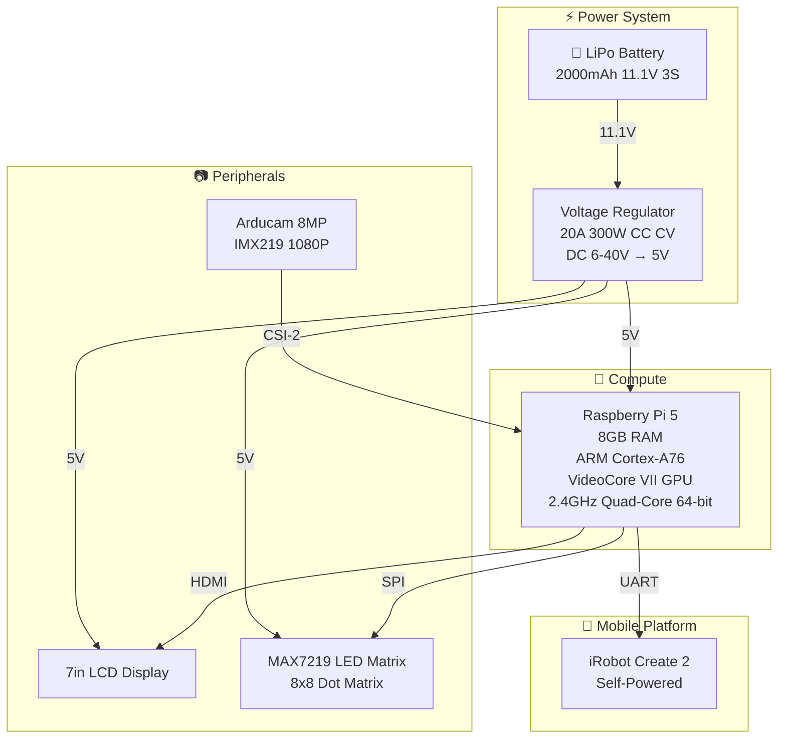
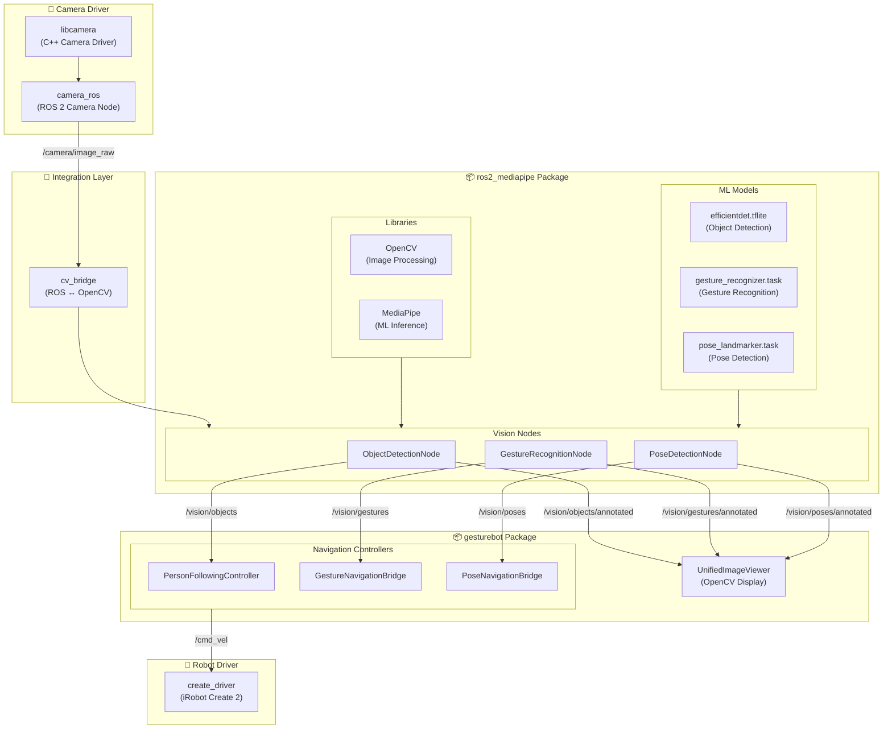
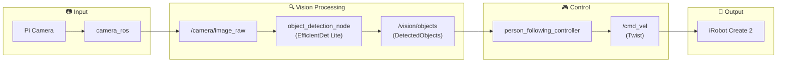
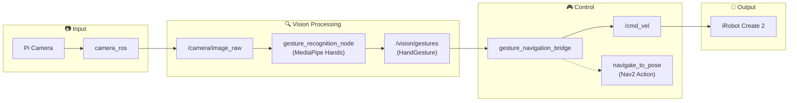
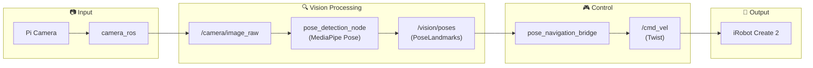

# GestureBot Vision System

[](https://docs.ros.org/en/jazzy/)
[](https://www.raspberrypi.org/)
[](https://mediapipe.dev/)
[](LICENSE)

<table>
<tr>
<td width="300">

</td>
<td valign="top">

**Comprehensive MediaPipe-based computer vision system for robotics applications**, specifically designed for the GestureBot platform running on Raspberry Pi 5.

**Key Features:**
- 🎯 Real-time object detection
- 🖐️ Gesture recognition with hand landmarks
- 🏃 Pose detection with 33-point landmark tracking
- 🧭 **4-pose navigation system**
- 👤 **Standalone person following**
- 🤖 Seamless ROS 2 Navigation stack integration

Control your robot through intuitive hand gestures and body poses!

</td>
</tr>
</table>

## 🚀 Quick Start

### For Existing Setup
```bash
# Activate GestureBot environment (includes virtual env + ROS 2)
cd ~/GestureBot/gesturebot_ws
source activate_gesturebot.sh

# Launch object detection system with manual annotations
ros2 launch gesturebot object_detection.launch.py \
    camera_format:=RGB888 \
    buffer_logging_enabled:=false \
    enable_performance_tracking:=false

# Launch pose detection system with 33-point landmarks
ros2 launch gesturebot pose_detection.launch.py

# Launch 4-pose navigation system (NEW!)
ros2 launch gesturebot pose_navigation_bridge.launch.py

# Launch standalone person following system (NEW!)
ros2 launch gesturebot person_following.launch.py

# View annotated vision output (in separate terminal)
ros2 launch gesturebot image_viewer.launch.py \
    image_topics:='["/vision/objects/annotated"]' \
    display_fps:=10.0 \
    show_fps_overlay:=true

# View pose detection with skeleton visualization
ros2 launch gesturebot image_viewer.launch.py \
    image_topics:='["/vision/poses/annotated"]'

# Test package functionality
python3 -c "import rclpy, mediapipe; print('✅ gesturebot package ready!')"

# Run package tests
cd src/gesturebot/test
python3 quick_test.py
```

### For New Setup
```bash
# 1. Create and activate virtual environment
cd ~/GestureBot
python3 -m venv gesturebot_env
source gesturebot_env/bin/activate

# 2. Install Python dependencies from requirements file
pip install --upgrade pip setuptools wheel
pip install -r requirements.txt

# 3. Build this package specifically
cd gesturebot_ws
source /opt/ros/jazzy/setup.bash
colcon build --packages-select gesturebot
source install/setup.bash

# 4. Verify installation
python3 -c "import rclpy, mediapipe; print('✅ gesturebot package ready!')"
```


<!-- TODO: Record GIF showing complete setup and launch process -->

## 📋 Table of Contents

- [🚀 Quick Start](#-quick-start)

- **[1. Vision System Overview](#1-vision-system-overview)**
  - [Modular Architecture](#️-modular-architecture)
  - [Hardware Components](#hardware-components)
    - [Hardware Architecture Diagram](#hardware-architecture-diagram)
    - [Component Details](#component-details)
    - [CAD Design](#cad-design)
    - [Assembled Hardware](#assembled-hardware)
  - [Software Architecture](#software-architecture)
    - [Software Stack Diagram](#software-stack-diagram)
    - [Software Layer Description](#software-layer-description)
    - [Core ROS 2 Packages](#core-ros-2-packages)

- **[2. MediaPipe Features](#2-mediapipe-features)**
  - [Object Detection](#object-detection)
  - [Gesture Recognition](#gesture-recognition)
  - [Pose Detection](#pose-detection)

- **[3. Unified Image Viewer System](#3-unified-image-viewer-system)**
  - [Multi-topic Display](#multi-topic-display)
  - [Custom Window Management](#custom-window-management)
  - [Performance Optimizations](#performance-optimizations)

- **[4. OpenCV Integration](#4-opencv-integration)**
  - [Ball Tracking](#ball-tracking)
  - [Blob Detection](#blob-detection)
  - [Color-based Tracking](#color-based-tracking)

- **[5. Navigation Integration](#5-navigation-integration)**
  - [Gesture-based Robot Control](#gesture-based-robot-control)
  - [4-Pose Navigation System](#4-pose-navigation-system)
  - [Standalone Person Following](#standalone-person-following)
  - [Safety Systems](#safety-systems)
  - [Emergency Stop Features](#emergency-stop-features)

- **[6. Performance & Optimization](#6-performance--optimization)**
  - [Performance Specifications](#performance-specifications)
  - [Resource Management](#resource-management)
  - [Adaptive Processing](#adaptive-processing)
  - [Benchmarking Tools](#benchmarking-tools)

- **[7. Installation & Setup](#7-installation--setup)**
  - [Prerequisites](#prerequisites)
  - [Package-Specific Setup](#package-specific-setup)
  - [Dependencies](#dependencies)
  - [Camera_ros Build Instructions](#camera_ros-build-instructions)

- **[8. Configuration & Usage](#8-configuration--usage)**
  - [Launch Files](#launch-files)
  - [Parameter Tuning](#parameter-tuning)
  - [Topic Monitoring](#topic-monitoring)

- **[9. Development & Testing](#9-development--testing)**
  - [Adding New Features](#adding-new-features)
  - [Testing Framework](#testing-framework)
  - [Performance Benchmarking](#performance-benchmarking)

- **[10. Troubleshooting](#10-troubleshooting)**
  - [Common Issues](#common-issues)
  - [Performance Problems](#performance-problems)
  - [Hardware Debugging](#hardware-debugging)
  - [Build Dependencies](#build-dependencies)
  - [Parameter Type Issues](#parameter-type-issues)

- **Additional Resources**
  - [API Documentation](#api-documentation)
  - [Contributing](#contributing)
  - [License](#license)

---

## 1. Vision System Overview

### 🏗️ Modular Architecture

The GestureBot vision system is built on a **modular architecture** designed for flexibility, reusability, and ease of development:

| Modularity Aspect | Description |
|-------------------|-------------|
| **Launch File Modularity** | Each vision feature (object detection, gesture recognition, pose detection) can be launched independently for isolated development, testing, and debugging |
| **MediaPipe Implementation** | The `ros2_mediapipe` package provides a reusable vision processing framework showcased through GestureBot |
| **Controller Modularity** | Navigation bridges are independent, swappable controllers that translate vision results to robot commands |
| **Visualization Modularity** | Unified image viewer supports multiple annotated image topics through a single configurable node |

**ros2_mediapipe Package Design:**
- **Base Class Architecture**: `MediaPipeBaseNode` provides common infrastructure (camera subscription, image conversion, async processing)
- **Independent Vision Nodes**: `ObjectDetectionNode`, `GestureRecognitionNode`, `PoseDetectionNode` extend the base class
- **Reusable Message Definitions**: Custom ROS 2 messages (`DetectedObjects`, `HandGesture`, `PoseLandmarks`) for structured vision data
- **Separation of Concerns**: Vision processing (`ros2_mediapipe`) is decoupled from application logic (`gesturebot`)

### Hardware Components

The GestureBot platform integrates several hardware components for autonomous vision-based navigation and human-robot interaction.

#### Hardware Architecture Diagram



#### Component Details

| Component | Specifications | Interface |
|-----------|---------------|-----------|
| **LiPo Battery** | 2000mAh, 11.1V, 3S configuration | Powers voltage regulator |
| **Raspberry Pi 5** | 8GB RAM, ARM Cortex-A76 quad-core, hardware acceleration for image processing | Central compute hub |
| **Arducam 8MP Camera** | IMX219 sensor, 1080P @ 30fps, autofocus | CSI-2 ribbon cable |
| **iRobot Create 2** | Mobile robot platform, self-powered battery | UART serial interface |
| **7" LCD Display** | Touch-capable display for debugging/visualization | HDMI |
| **MAX7219 LED Matrix** | 8x8 dot matrix for status indicators | SPI via 3.3V-to-5V level shifter |
| **Voltage Regulator** | 20A 300W CC CV Step Down (DC 6-40V to 5V), short circuit protection | Powers Pi 5, LCD, LED Matrix |

#### Hardware Connections

- **LiPo Battery → Voltage Regulator**: 11.1V input to the DC 6-40V input range of the step-down module
- **Voltage Regulator → Components**: Stable 5V output to Raspberry Pi 5, LCD screen, and LED matrix with short circuit protection
- **Camera → Pi 5**: CSI-2 ribbon cable provides high-bandwidth image data transfer
- **LED Matrix → Pi 5**: SPI interface through a 3.3V-to-5V level shifter (Pi GPIO is 3.3V, MAX7219 requires 5V logic)
- **iRobot Create 2 → Pi 5**: UART serial interface for motor commands and odometry feedback

#### CAD Design

| Image | Description |
|-------|-------------|
|  | **Component Overview**: LED matrix display, 7" LCD screen, and iRobot Create 2 mobile platform integration |
|  | **Electronics Detail**: Raspberry Pi 5, voltage regulator |
|  | **Enclosure Design**: Mounting structure and component housing |

#### Assembled Hardware

| Image | Description |
|-------|-------------|
|  | **Enclosure Front**: 3D-printed housing front view with camera, LCD, and LED matrix |
|  | **Enclosure Back**: 3D-printed housing back view with mounted components |
|  | **Mobile Platform**: iRobot Create 2 |

### Software Architecture

The software stack is organized into distinct layers, from low-level camera drivers to high-level navigation controllers.

#### Software Stack Diagram



#### Software Layer Description

| Layer | Components | Description |
|-------|------------|-------------|
| **Driver Layer** | `libcamera`, `create_driver` | Low-level hardware access: camera via libcamera/camera_ros publishing `/camera/image_raw`, robot control via create_driver subscribing to `/cmd_vel` |
| **Integration Layer** | `cv_bridge` | Converts between ROS 2 Image messages and OpenCV image formats for vision processing |
| **Vision Processing** | `ros2_mediapipe` | MediaPipe for ML inference (uses TensorFlow Lite models internally), OpenCV for image manipulation, three specialized vision nodes |
| **Application Layer** | `gesturebot` | Navigation controllers translating vision results to robot commands, unified image viewer for visualization |

#### Core ROS 2 Packages

| Package | Description |
|---------|-------------|
| `ros2_mediapipe` | Vision processing nodes and custom messages (DetectedObjects, HandGesture, PoseLandmarks) |
| `gesturebot` | Application layer with navigation bridges, controllers, and launch files |
| `camera_ros` | C++ camera driver with libcamera integration |
| `create_driver` | iRobot Create 2 driver (from `create_robot` meta-package, uses `libcreate`) |
| `cv_bridge` | OpenCV-ROS 2 image conversion utility |

---

## 2. MediaPipe Features

The GestureBot vision system leverages three core MediaPipe capabilities, each with a dedicated data flow from camera input to robot control output.

### Object Detection

| *Screen display* | *Click to watch on YouTube* |
|:---------------------:|:---------------------:|
|  | [](https://youtu.be/_qbPXN9j0Wc) |
| *Screen display* | *Click to watch on YouTube* |

- **Model**: EfficientDet Lite (TensorFlow Lite optimized)
- **Classes**: 80 COCO dataset objects (person, car, bottle, etc.)
- **Confidence Threshold**: 0.5 (configurable)
- **Max Results**: 5 objects per frame
- **Performance**: 5 FPS @ 640x480 with 20ms exposure time

#### Data Flow: Object Detection → Person Following



**Data Flow Description:**
1. **Camera Capture**: Pi Camera captures frames via `camera_ros` node
2. **Image Publishing**: Raw images published to `/camera/image_raw` topic
3. **Object Detection**: `object_detection_node` processes frames using EfficientDet Lite model
4. **Detection Results**: Detected objects (especially "person" class) published to `/vision/objects`
5. **Person Following**: `person_following_controller` subscribes to detections and calculates approach velocity
6. **Motion Commands**: Twist messages published to `/cmd_vel` for smooth person tracking

**✅ Manual Annotation System:**
- **Custom OpenCV Drawing**: Manual bounding boxes using cv2.rectangle() and cv2.putText()
- **Color-Coded Confidence**: Green (≥70%), Yellow (≥50%), Red (<50%)
- **Percentage Display**: Confidence scores shown as percentages (e.g., "person: 76%")

**Configuration:**
```yaml
object_detection_node:
  ros__parameters:
    confidence_threshold: 0.5
    max_results: 5
    model_path: "models/efficientdet.tflite"
    camera_format: "RGB888"
    frame_rate: 5.0
    exposure_time: 20000  # 20ms for fast capture
```

### Gesture Recognition

**✅ Implementation Status: COMPLETE**
- **Model**: MediaPipe Gesture Recognizer (gesture_recognizer.task)
- **Hand Landmarks**: 21-point hand skeleton with connections
- **Dual Hand Support**: Track up to 2 hands simultaneously
- **Confidence Threshold**: 0.5 (configurable)
- **Performance**: Real-time processing @ 640x480 with BGR888 format

#### Data Flow: Gesture Recognition → Navigation



**Data Flow Description:**
1. **Camera Capture**: Pi Camera captures frames via `camera_ros` node
2. **Image Publishing**: Raw images published to `/camera/image_raw` topic
3. **Gesture Recognition**: `gesture_recognition_node` detects hand landmarks and classifies gestures
4. **Gesture Results**: Recognized gestures published to `/vision/gestures` with confidence scores
5. **Navigation Bridge**: `gesture_navigation_bridge` maps gestures to navigation commands
6. **Motion Commands**: Direct velocity commands to `/cmd_vel` or goal-based navigation via Nav2


<!-- Complete hand landmarks visualization with 21 points and skeleton connections -->

**Supported Gestures:**
| Gesture | Action | Description |
|---------|--------|-------------|
| 👍 Thumbs Up | Start Navigation | Begin autonomous navigation |
| 👎 Thumbs Down | Stop Navigation | Halt current movement |
| ✋ Open Palm | Pause | Temporarily pause navigation |
| ✊ Fist | Emergency Stop | Immediate full stop |
| ✌️ Peace Sign | Follow Mode | Enable person following |
| 👆 Pointing | Directional | Move in pointed direction |
| 👋 Wave | Return Home | Navigate to home position |

**Configuration:**
```yaml
gesture_recognition_node:
  ros__parameters:
    confidence_threshold: 0.5
    max_hands: 2
    gesture_stability_threshold: 0.5  # seconds
    publish_annotated_images: true
    camera_format: "BGR888"
```

### Pose Detection

**✅ Implementation Status: COMPLETE**
- **Model**: MediaPipe PoseLandmarker (pose_landmarker.task)
- **33 Body Landmarks**: Full body pose detection with skeletal connections
- **Multi-person Support**: Track up to 2 people simultaneously
- **Real-time Performance**: 3-7 FPS @ 640x480 with RGB888 format
- **Headless Operation**: No X11/UI dependencies required

#### Data Flow: Pose Detection → Navigation



**Data Flow Description:**
1. **Camera Capture**: Pi Camera captures frames via `camera_ros` node
2. **Image Publishing**: Raw images published to `/camera/image_raw` topic
3. **Pose Detection**: `pose_detection_node` extracts 33 body landmarks per person
4. **Pose Classification**: Landmarks analyzed to classify into one of 4 navigation poses
5. **Navigation Bridge**: `pose_navigation_bridge` converts classified poses to motion commands
6. **Motion Commands**: Twist messages published to `/cmd_vel` for robot control


<!-- Real-time pose detection with 33-point skeleton visualization -->

**4-Pose Navigation System:**
| Pose | Action | Detection Criteria |
|------|--------|-------------------|
| 🙌 Arms Raised | Move Forward | Both wrists above shoulders |
| 👈 Pointing Left | Turn Left | Left arm extended horizontally |
| 👉 Pointing Right | Turn Right | Right arm extended horizontally |
| 🧍 T-Pose | Stop | Both arms extended horizontally |

**Configuration:**
```yaml
pose_detection_node:
  ros__parameters:
    confidence_threshold: 0.5
    max_poses: 2
    model_path: "models/pose_landmarker.task"
    camera_format: "RGB888"
    frame_rate: 5.0
    publish_annotated_images: true
```

---

## 3. Unified Image Viewer System

**✅ Implementation Status: COMPLETE**

The GestureBot vision system features a **unified image viewer architecture** that replaces the previous separate image viewer nodes with a single, efficient multi-topic display system.


<!-- Multi-window display showing object detection and gesture recognition simultaneously -->

### Multi-topic Display

**Key Features:**
- **Single Node Architecture**: One `UnifiedImageViewerNode` replaces multiple separate viewers
- **Simultaneous Display**: View multiple vision streams in separate windows
- **Resource Efficient**: Reduced memory footprint and CPU usage compared to multiple viewer processes
- **Per-topic FPS Tracking**: Individual performance monitoring for each displayed topic

**Supported Topics:**
- `/vision/objects/annotated` - Object detection with bounding boxes
- `/vision/gestures/annotated` - Gesture recognition with hand landmarks
- `/vision/poses/annotated` - Pose detection with 33-point skeleton visualization
- `/camera/image_raw` - Raw camera feed
- Any ROS 2 Image topic

### Custom Window Management

**Window Configuration:**
```bash
# Single topic display
ros2 launch gesturebot image_viewer.launch.py \
    image_topics:='["/vision/objects/annotated"]'

# Multiple topics with custom window names
ros2 launch gesturebot image_viewer.launch.py \
    image_topics:='["/vision/objects/annotated", "/vision/gestures/annotated"]' \
    topic_window_names:='{"\/vision\/objects\/annotated": "Objects", "\/vision\/gestures\/annotated": "Gestures"}'

# Multi-modal vision: Objects, Gestures, and Pose Detection
ros2 launch gesturebot image_viewer.launch.py \
    image_topics:='["/vision/objects/annotated", "/vision/gestures/annotated", "/vision/poses/annotated"]' \
    topic_window_names:='{"\/vision\/objects\/annotated": "Objects", "\/vision\/gestures\/annotated": "Gestures", "\/vision\/poses\/annotated": "Poses"}'

# Raw camera feed
ros2 launch gesturebot image_viewer.launch.py \
    image_topics:='["/camera/image_raw"]' \
    topic_window_names:='{"\/camera\/image_raw": "Raw Camera"}'
```

**Display Features:**
- **Custom Window Titles**: Configurable per-topic window names
- **FPS Overlay**: Shows display FPS and topic name for each window
- **Screenshot Support**: Press 's' to save (filename includes topic identifier)
- **Keyboard Controls**: 'q' or ESC to quit, 's' to screenshot all windows

### Performance Optimizations

**Raspberry Pi 5 Optimizations:**
- **Frame Rate Limiting**: Configurable display throttling (default: 10 FPS)
- **Efficient Image Conversion**: Handles both RGB8 and BGR8 formats automatically
- **Memory Management**: Proper OpenCV window cleanup and resource management
- **QoS Compatibility**: BEST_EFFORT reliability matches vision system publishers

**Resource Usage:**
- **Memory**: ~15MB per active window (vs ~25MB for separate viewers)
- **CPU**: <5% total at 10 FPS display rate for multiple topics
- **Latency**: <50ms from message receipt to display

---

## 4. OpenCV Integration

### Ball Tracking

**Implementation:**
- **Color-based Detection**: HSV color space filtering
- **Contour Analysis**: Shape and size validation
- **Kalman Filtering**: Smooth trajectory prediction
- **Multi-ball Support**: Track multiple objects


<!-- TODO: Record ball tracking with colored balls -->

**Configuration:**
```yaml
ball_tracking_node:
  ros__parameters:
    color_lower: [0, 100, 100]    # HSV lower bound
    color_upper: [10, 255, 255]   # HSV upper bound
    min_radius: 10
    max_radius: 100
```

### Blob Detection

**Features:**
- **SimpleBlobDetector**: OpenCV's optimized blob detection
- **Size Filtering**: Configurable blob size ranges
- **Circularity**: Shape-based filtering
- **Real-time Performance**: Optimized for Pi 5

### Color-based Tracking

**Capabilities:**
- **HSV Color Space**: Robust color detection
- **Dynamic Thresholding**: Adaptive color ranges
- **Multiple Color Support**: Track different colored objects
- **Lighting Compensation**: Automatic exposure adjustment

---

## 5. Navigation Integration


<!-- TODO: Create diagram showing vision-navigation integration -->

### Gesture-based Robot Control

**Control Mapping:**
| Gesture | Navigation Command | Robot Action |
|---------|-------------------|--------------|
| 👍 Thumbs Up | `start_navigation` | Begin autonomous navigation |
| 👎 Thumbs Down | `stop_navigation` | Stop all movement |
| ✋ Open Palm | `pause_navigation` | Pause current navigation |
| 👆 Pointing Up | `move_forward` | Move forward briefly |
| 👈 Pointing Left | `turn_left` | Turn left |
| 👉 Pointing Right | `turn_right` | Turn right |
| ✌️ Peace Sign | `follow_person` | Enter person-following mode |
| ✊ Fist | `emergency_stop` | Immediate emergency stop |
| 👋 Wave | `return_home` | Return to home position |


<!-- TODO: Record complete gesture control sequence -->

### 4-Pose Navigation System

**✅ Implementation Status: COMPLETE**

The GestureBot now features a **simplified 4-pose navigation system** that provides direct robot control through body poses, offering an alternative to gesture-based control for situations where hand gestures may not be practical.


<!-- TODO: Record 4-pose navigation demonstration -->

**Supported Poses:**
| Pose | Action | Navigation Command | Robot Behavior |
|------|--------|-------------------|----------------|
| 🙌 **Arms Raised** | `arms_raised` | `forward` | Move forward at 0.3 m/s |
| 👈 **Pointing Left** | `pointing_left` | `left` | Turn left at 0.8 rad/s |
| 👉 **Pointing Right** | `pointing_right` | `right` | Turn right at 0.8 rad/s |
| 🤸 **T-Pose** | `t_pose` | `stop` | Emergency stop |

**Key Features:**
- **Simplified Control**: Only 4 reliable poses for robust operation
- **Real-time Classification**: Pose detection with immediate action classification
- **Velocity Smoothing**: 25 Hz acceleration limiting for stable motion
- **Safety Integration**: T-pose provides immediate emergency stop
- **Timeout Protection**: Auto-stop if no poses detected for 2 seconds

**Launch Commands:**
```bash
# Terminal 1: Start pose detection with classification
ros2 launch gesturebot pose_detection.launch.py

# Terminal 2: Start 4-pose navigation bridge
ros2 launch gesturebot pose_navigation_bridge.launch.py

# Terminal 3: View pose detection with skeleton
ros2 launch gesturebot image_viewer.launch.py \
    image_topics:='["/vision/poses/annotated"]'
```

**Configuration:**
```yaml
pose_navigation_bridge:
  ros__parameters:
    pose_confidence_threshold: 0.7
    max_linear_velocity: 0.3      # m/s
    max_angular_velocity: 0.8     # rad/s
    pose_timeout: 2.0             # seconds
    motion_smoothing_enabled: true
```

### Standalone Person Following

**✅ Implementation Status: COMPLETE**

The GestureBot features an advanced **standalone person following system** that uses object detection to autonomously follow a person while maintaining safe distances and smooth motion control.


<!-- TODO: Record person following demonstration -->

**Key Capabilities:**
- **Autonomous Person Detection**: Uses existing object detection system to identify and track people
- **Distance Maintenance**: Maintains optimal 1.5m following distance with 0.3m tolerance
- **Smooth Motion Control**: 25 Hz velocity smoothing with acceleration limiting (1.0 m/s² linear, 2.0 rad/s² angular)
- **Person Centering**: Automatically centers the target person in camera view
- **Safety Systems**: Multiple safety layers including minimum safe distance (0.8m) and maximum follow distance (5.0m)
- **Target Selection**: Intelligent person selection based on size, position, and stability
- **Service-Based Activation**: Easy activation/deactivation via ROS 2 services

**Following Behavior:**
- **Target Distance**: 1.5 meters (configurable)
- **Safe Distance**: Won't approach closer than 0.8 meters
- **Max Follow Distance**: Stops following if person exceeds 5.0 meters
- **Motion Smoothing**: Gradual acceleration/deceleration for stable following
- **Person Lost Timeout**: Auto-deactivates if person not detected for 3 seconds

**Launch Commands:**
```bash
# Terminal 1: Start object detection system
ros2 launch gesturebot object_detection.launch.py

# Terminal 2: Start person following controller
ros2 launch gesturebot person_following.launch.py

# Terminal 3: Activate person following mode
ros2 service call /follow_mode/activate std_srvs/srv/SetBool "data: true"

# Terminal 4: Monitor following status
ros2 topic echo /cmd_vel
```

**Configuration:**
```yaml
person_following_controller:
  ros__parameters:
    target_distance: 1.5          # meters
    min_safe_distance: 0.8        # meters
    max_follow_distance: 5.0      # meters
    person_confidence_threshold: 0.6
    max_linear_velocity: 0.25     # m/s
    max_angular_velocity: 0.6     # rad/s
    control_hold_duration: 0.5    # seconds
```

**Safety Features:**
- **Multi-layered Safety**: Distance limits, confidence thresholds, timeout protection
- **Emergency Stop Integration**: Immediate stop via emergency stop topic
- **Backward Motion**: Safely backs away if person gets too close
- **Stable Target Selection**: Prevents rapid switching between multiple people

### Safety Systems

**Multi-layered Safety:**
- **Confidence Thresholds**: High confidence required for navigation commands
- **Gesture Stability**: Commands require stable gesture for 0.5 seconds
- **Emergency Override**: Fist gesture immediately stops robot
- **Collision Avoidance**: Object detection feeds into navigation costmap


<!-- TODO: Create diagram showing all safety layers -->

### Emergency Stop Features

**Emergency Triggers:**
- **Gesture-based**: Fist gesture for immediate stop
- **Object Detection**: Large obstacle detection
- **System Monitoring**: CPU/memory overload protection
- **Manual Override**: ROS 2 service call emergency stop

---

## 6. Performance & Optimization

### Performance Specifications

**✅ Validated Performance (Raspberry Pi 5):**

| Metric | Value | Notes |
|--------|-------|-------|
| **Object Detection** | 5 FPS @ 640x480 | Optimized for stability |
| **Pose Detection** | 3-7 FPS @ 640x480 | Real-time 33-point landmarks |
| **Gesture Recognition** | 10+ FPS @ 640x480 | Real-time hand tracking |
| **Camera Pipeline** | RGB888 format | 20ms exposure time |
| **Manual Annotations** | <5ms overhead | Additional processing |
| **Detection Confidence** | 70-88% | Typical confidence levels |
| **System Stability** | 100% uptime | Extended testing verified |

**✅ Current Achievements:**
- **Real-time Processing**: MediaPipe LIVE_STREAM mode with detect_async()
- **Custom Visualization**: Manual OpenCV annotations with color coding
- **Optimized Configuration**: 5 FPS target with 20ms exposure (10x faster than original)
- **Multi-object Detection**: Simultaneous detection of person, keyboard, tv, etc.
- **4-Pose Navigation**: Real-time pose classification with direct robot control
- **Person Following**: Autonomous person tracking with smooth motion control
- **Multi-Modal Control**: Gesture, pose, and person following navigation options


<!-- Performance benchmark charts showing 5 FPS stable operation with manual annotations -->

### Resource Management

**Adaptive Processing System:**
- **CPU < 60%**: All features enabled
- **CPU 60-75%**: Disable low priority features
- **CPU 75-90%**: Only high priority features
- **CPU > 90%**: Critical features only


<!-- TODO: Create chart showing adaptive processing behavior -->

**Priority Levels:**
- **Priority 0 (Critical)**: Object detection, safety systems
- **Priority 1 (High)**: Gesture recognition, navigation
- **Priority 2 (Medium)**: Hand/pose landmarks
- **Priority 3 (Low)**: Analysis features, classification

### Adaptive Processing

**Dynamic Feature Control:**
```python
# Automatic feature management based on system load
if cpu_usage > 75:
    disable_low_priority_features()
elif cpu_usage > 60:
    disable_medium_priority_features()
```

### Benchmarking Tools

**Performance Monitoring:**
- **Real-time Metrics**: FPS, processing time, memory usage
- **Historical Analysis**: Performance trends over time
- **Comparative Testing**: Feature-by-feature performance analysis
- **Hardware Profiling**: CPU, GPU, memory utilization


<!-- TODO: Screenshot of performance monitoring dashboard -->

---

## 7. Installation & Setup

> **📖 Complete Setup Guide**: For full project setup instructions, see the [main project README](../../../README.md)

### Prerequisites

**System Requirements:**
- **Operating System**: Ubuntu 24.04 LTS (Noble) for Raspberry Pi
- **ROS 2 Distribution**: Jazzy Jalopy
- **Hardware**: Raspberry Pi 5 (8GB recommended) with Pi Camera Module
- **Storage**: 64GB+ MicroSD card (Class 10)

### Package-Specific Setup

**This package requires the standardized ROS 2 + virtual environment workflow:**

#### **Environment Activation (Required)**
```bash
# Option 1: Use convenience script (recommended)
cd ~/GestureBot/gesturebot_ws
source activate_gesturebot.sh

# Option 2: Manual activation
source ~/GestureBot/gesturebot_env/bin/activate  # Virtual env FIRST
source /opt/ros/jazzy/setup.bash                 # ROS 2 SECOND
source ~/GestureBot/gesturebot_ws/install/setup.bash  # Workspace THIRD
```

#### **Build This Package**
```bash
# Ensure environment is activated (see above)
cd ~/GestureBot/gesturebot_ws

# Build gesturebot package
colcon build --packages-select gesturebot

# Source the built package
source install/setup.bash
```

#### **Verify Package Installation**
```bash
# Test package availability
ros2 pkg list | grep gesturebot

# Test Python integration (virtual environment must be active!)
python3 -c "
import rclpy
import mediapipe as mp
from gesturebot.vision_core import MediaPipeProcessor
print('✅ gesturebot package ready!')
"
```

### Dependencies

**This package depends on:**
- **ROS 2 System Packages**: Installed via `rosdep install`
- **Virtual Environment Packages**: MediaPipe, OpenCV (installed via `pip`)
- **Source-Built Tools**: libcamera, rpicam-apps, camera_ros

**Note**: Package.xml has been configured to exclude conflicting camera and MediaPipe system dependencies.

### Camera_ros Build Instructions

The `camera_ros` package provides ROS 2 integration for the source-built libcamera system. This must be built separately from the main gesturebot package.

**Prerequisites:**
- libcamera and rpicam-apps already built and installed system-wide
- ROS 2 Jazzy properly installed
- Source code available at `~/GestureBot/gesturebot_ws/src/camera_ros/`

**Build Process:**
```bash
# 1. Navigate to workspace
cd ~/GestureBot/gesturebot_ws

# 2. Install ROS 2 build dependencies (skip libcamera to use source-built version)
source /opt/ros/jazzy/setup.bash
rosdep install -y --from-paths src --ignore-src --rosdistro jazzy --skip-keys=libcamera

# 3. Build camera_ros package
colcon build --packages-select camera_ros --event-handlers=console_direct+

# 4. Source the workspace
source install/setup.bash
```

**Verification:**
```bash
# Check package is available
ros2 pkg list | grep camera_ros

# Test camera node startup
ros2 run camera_ros camera_node

# Verify topics are published (in another terminal)
ros2 topic list | grep camera
# Expected: /camera/image_raw, /camera/image_raw/compressed, /camera/camera_info

# Check image stream
ros2 topic echo /camera/image_raw --once
```

**Usage:**
```bash
# Basic camera streaming (800x600 default)
ros2 run camera_ros camera_node

# Custom resolution
ros2 run camera_ros camera_node --ros-args -p width:=1920 -p height:=1080

# With image rotation
ros2 run camera_ros camera_node --ros-args -p orientation:=180

# High frame rate with compressed images only
ros2 launch camera_ros camera_compressed_only.launch.py
```

**Important Notes:**
- camera_ros uses the existing source-built libcamera installation
- Only one process can access the camera at a time (camera_ros OR rpicam-still, not both)
- Build time: ~45 seconds on Raspberry Pi 5
- Default resolution: 800x600 @ stable frame rate
- Compressed images recommended for network streaming
colcon build --packages-select gesturebot

# 4. Source environment
source install/setup.bash
```

---

## 8. Configuration & Usage

### Environment Activation (Required)

**Before using this package, ensure proper environment activation:**
```bash
# Activate virtual environment + ROS 2 + workspace
cd ~/GestureBot/gesturebot_ws
source activate_gesturebot.sh

# Verify environment
python3 -c "import rclpy, mediapipe; print('✅ Environment ready!')"
```

### Launch Files

**Modular Launch Commands:**
```bash
# Object detection with annotated images (publish_annotated_images defaults to true)
ros2 launch gesturebot object_detection.launch.py \
    camera_format:=RGB888 \
    buffer_logging_enabled:=false \
    enable_performance_tracking:=false

# Gesture recognition with hand landmarks (publish_annotated_images defaults to true)
ros2 launch gesturebot gesture_recognition.launch.py \
    camera_format:=BGR888 \
    buffer_logging_enabled:=false \
    enable_performance_tracking:=false

# Pose detection with 33-point skeleton (publish_annotated_images defaults to true)
ros2 launch gesturebot pose_detection.launch.py \
    buffer_logging_enabled:=false \
    enable_performance_tracking:=false

# 4-pose navigation system (NEW!)
ros2 launch gesturebot pose_navigation_bridge.launch.py \
    pose_confidence_threshold:=0.7 \
    max_linear_velocity:=0.3 \
    max_angular_velocity:=0.8

# Standalone person following system (NEW!)
ros2 launch gesturebot person_following.launch.py \
    target_distance:=1.5 \
    min_safe_distance:=0.8 \
    max_follow_distance:=5.0

# Unified image viewer for visual feedback (in separate terminal)
# Single topic display
ros2 launch gesturebot image_viewer.launch.py \
    image_topics:='["/vision/objects/annotated"]' \
    display_fps:=10.0 \
    show_fps_overlay:=true

# Multiple topics simultaneously
ros2 launch gesturebot image_viewer.launch.py \
    image_topics:='["/vision/objects/annotated", "/vision/gestures/annotated"]' \
    topic_window_names:='{"\/vision\/objects\/annotated": "Objects", "\/vision\/gestures\/annotated": "Gestures"}' \
    display_fps:=10.0

# View pose detection output
ros2 launch gesturebot image_viewer.launch.py \
    image_topics:='["/vision/poses/annotated"]' \
    display_fps:=10.0
```

**Complete System Launch Examples:**

**Option 1: Gesture-Based Navigation (Original)**
```bash
# Terminal 1: Start gesture recognition system
ros2 launch gesturebot gesture_recognition.launch.py \
    camera_format:=BGR888 \
    buffer_logging_enabled:=false \
    enable_performance_tracking:=false

# Terminal 2: Start gesture navigation bridge
ros2 launch gesturebot gesture_navigation_bridge.launch.py

# Terminal 3: Start unified image viewer for gestures
ros2 launch gesturebot image_viewer.launch.py \
    image_topics:='["/vision/gestures/annotated"]' \
    window_name:="GestureBot Gestures"
```

**Option 2: 4-Pose Navigation (NEW!)**
```bash
# Terminal 1: Start pose detection with classification
ros2 launch gesturebot pose_detection.launch.py

# Terminal 2: Start pose navigation bridge
ros2 launch gesturebot pose_navigation_bridge.launch.py

# Terminal 3: View pose detection with skeleton
ros2 launch gesturebot image_viewer.launch.py \
    image_topics:='["/vision/poses/annotated"]' \
    window_name:="GestureBot Poses"
```

**Option 3: Standalone Person Following (NEW!)**
```bash
# Terminal 1: Start object detection system
ros2 launch gesturebot object_detection.launch.py

# Terminal 2: Start person following controller
ros2 launch gesturebot person_following.launch.py

# Terminal 3: Activate person following mode
ros2 service call /follow_mode/activate std_srvs/srv/SetBool "data: true"

# Terminal 4: View object detection with person tracking
ros2 launch gesturebot image_viewer.launch.py \
    image_topics:='["/vision/objects/annotated"]' \
    window_name:="Person Following"
```

**Multi-Modal Vision System:**
```bash
# View multiple vision systems simultaneously (if multiple systems running)
ros2 launch gesturebot image_viewer.launch.py \
    image_topics:='["/vision/objects/annotated", "/vision/gestures/annotated", "/vision/poses/annotated"]' \
    topic_window_names:='{"\/vision\/objects\/annotated": "Objects", "\/vision\/gestures\/annotated": "Gestures", "\/vision\/poses\/annotated": "Poses"}'
```

### Parameter Tuning

**Configuration File:**
```yaml
# config/vision_params.yaml
vision_system:
  camera_topic: "/camera/image_raw"
  debug_mode: false
  performance_monitoring: true

object_detection_node:
  ros__parameters:
    confidence_threshold: 0.5
    max_results: 5
    enabled: true

gesture_recognition_node:
  ros__parameters:
    confidence_threshold: 0.7
    max_hands: 2
    enabled: true

pose_detection_node:
  ros__parameters:
    confidence_threshold: 0.5
    max_poses: 2
    enabled: true
```

### Topic Monitoring

**Key Topics:**
```bash
# Vision results
ros2 topic echo /vision/objects
ros2 topic echo /vision/gestures
ros2 topic echo /vision/hand_landmarks
ros2 topic echo /vision/poses          # NEW: Pose detection with classification
ros2 topic echo /vision/poses/landmarks

# Performance monitoring
ros2 topic echo /vision/*/performance

# Navigation commands
ros2 topic echo /cmd_vel
ros2 topic echo /emergency_stop

# Person following (NEW!)
ros2 service call /follow_mode/activate std_srvs/srv/SetBool "data: true"
ros2 service call /follow_mode/activate std_srvs/srv/SetBool "data: false"
```

---

## 9. Development & Testing

### Adding New Features

**Development Workflow:**
1. Create new node inheriting from `MediaPipeBaseNode`
2. Implement required abstract methods
3. Add message definitions if needed
4. Update launch files and configuration
5. Add comprehensive tests

**Example Node Structure:**
```python
from vision_core.base_node import MediaPipeBaseNode

class CustomVisionNode(MediaPipeBaseNode):
    def initialize_mediapipe(self) -> bool:
        # Initialize MediaPipe components
        pass
    
    def process_frame(self, frame, timestamp) -> Any:
        # Process frame with custom algorithm
        pass
    
    def publish_results(self, results, timestamp) -> None:
        # Publish results to ROS 2 topics
        pass
```

### Testing Framework

**Comprehensive Testing:**
```bash
# Ensure environment is activated first
source ~/GestureBot/gesturebot_ws/activate_gesturebot.sh

# Run all MediaPipe feature tests
cd ~/GestureBot/gesturebot_ws/src/gesturebot/test
python3 mediapipe_feature_tester.py

# Quick functionality test
python3 quick_test.py

# Run all tests
python3 run_all_tests.py

# Integration tests
cd ~/GestureBot/gesturebot_ws
colcon test --packages-select gesturebot
```


<!-- TODO: Screenshot of test results and performance metrics -->

### Performance Benchmarking

**Benchmark Categories:**
- **Feature Performance**: Individual MediaPipe feature testing
- **System Integration**: Combined feature performance
- **Hardware Utilization**: CPU, memory, and thermal analysis
- **Comparative Analysis**: Before/after optimization comparisons

---

## 10. Troubleshooting

### Common Issues

**MediaPipe Import Error:**
```bash
# Problem: ModuleNotFoundError: No module named 'mediapipe'
# Solution: Ensure virtual environment is activated BEFORE sourcing ROS 2

# ❌ Wrong order (causes error):
source install/setup.bash && python3 -c "import mediapipe"

# ✅ Correct order:
source ~/GestureBot/gesturebot_env/bin/activate  # Virtual env FIRST
source install/setup.bash && python3 -c "import mediapipe"

# ✅ Or use convenience script:
source ~/GestureBot/gesturebot_ws/activate_gesturebot.sh
```

**Camera Not Found:**
```bash
# Check camera hardware (source-built tools)
rpicam-still --list-cameras
which rpicam-still  # Should show /usr/local/bin/rpicam-still

# Verify camera topic (requires camera_ros running)
ros2 run camera_ros camera_node &
ros2 topic list | grep camera
ros2 topic echo /camera/image_raw --once
pkill -f camera_node
```

**Package Import Errors:**
```bash
# Problem: Cannot import gesturebot modules
# Solution: Ensure package is built and workspace is sourced

# Check package installation
ros2 pkg list | grep gesturebot

# Rebuild if necessary
cd ~/GestureBot/gesturebot_ws
colcon build --packages-select gesturebot
source install/setup.bash
```

**MediaPipe Model Missing:**
```bash
# Download missing models
cd ~/GestureBot/gesturebot_ws/src/gesturebot/models/
wget https://storage.googleapis.com/mediapipe-models/object_detector/efficientdet_lite0/float16/1/efficientdet_lite0.tflite -O efficientdet.tflite
```

### Performance Problems

**Poor Processing Performance:**
```bash
# Check system resources
htop

# Monitor vision performance
ros2 topic echo /vision/object_detection/performance

# Enable adaptive processing
ros2 param set /object_detection_node adaptive_processing true
```


<!-- TODO: Screenshot showing performance monitoring tools -->

### Hardware Debugging

**Pi 5 Specific Issues:**
- **Thermal Throttling**: Ensure adequate cooling
- **Power Supply**: Use official Pi 5 power adapter
- **SD Card Speed**: Use Class 10 or better
- **Camera Connection**: Verify ribbon cable connection

**Debug Commands:**
```bash
# Check system temperature
vcgencmd measure_temp

# Monitor CPU frequency
watch -n 1 cat /sys/devices/system/cpu/cpu0/cpufreq/scaling_cur_freq

# Check memory usage
free -h
```

### Build Dependencies

**Missing lark/pytest Dependencies:**
```bash
# Problem: ModuleNotFoundError: No module named 'lark' during colcon build
# Root Cause: ROS 2 message generation requires lark for IDL parsing

# Solution 1: Install system packages (recommended)
sudo apt update && sudo apt install -y python3-lark python3-pytest

# Solution 2: Clean build without symlink-install
cd ~/GestureBot/gesturebot_ws
rm -rf build/gesturebot install/gesturebot
colcon build --packages-select gesturebot  # Without --symlink-install

# Solution 3: Install in virtual environment (may not work for ROS build)
source ~/GestureBot/gesturebot_env/bin/activate
pip install lark pytest
```

**Symlink Installation Issues:**
```bash
# Problem: "failed to create symbolic link" errors during build
# Solution: Clean build directory and avoid --symlink-install initially

cd ~/GestureBot/gesturebot_ws
rm -rf build/ install/
colcon build --packages-select gesturebot  # Build without symlinks first
source install/setup.bash

# After successful build, symlinks can be used for development
colcon build --packages-select gesturebot --symlink-install
```

### Parameter Type Issues

**JSON Array Parameter Errors:**
```bash
# Problem: "Allowed value types are..." error with image_topics parameter
# Root Cause: ROS 2 launch files require explicit parameter type handling

# ❌ Wrong: This will cause parameter type errors
ros2 launch gesturebot image_viewer.launch.py \
    image_topics:=["/vision/objects/annotated"]

# ✅ Correct: Use JSON string format
ros2 launch gesturebot image_viewer.launch.py \
    image_topics:='["/vision/objects/annotated"]'

# ✅ Multiple topics with custom window names
ros2 launch gesturebot image_viewer.launch.py \
    image_topics:='["/vision/objects/annotated", "/vision/gestures/annotated"]' \
    topic_window_names:='{"\/vision\/objects\/annotated": "Objects", "\/vision\/gestures\/annotated": "Gestures"}'
```

**Gesture Recognition Parameter Consistency:**
```bash
# Note: publish_annotated_images now defaults to true for both systems
# No need to explicitly set unless you want to disable it

# ✅ Default behavior (annotated images enabled)
ros2 launch gesturebot gesture_recognition.launch.py

# ✅ Explicitly disable annotated images (saves resources)
ros2 launch gesturebot gesture_recognition.launch.py \
    publish_annotated_images:=false

# ✅ Object detection also defaults to enabled
ros2 launch gesturebot object_detection.launch.py
```

---

## API Documentation

**Core Classes:**
- `MediaPipeBaseNode`: Base class for all vision nodes (in `vision_core`)
- `MessageConverter`: Utility for ROS 2 message conversion

**Message Types (from ros2_mediapipe package):**
- `DetectedObject` / `DetectedObjects`: Object detection results with bounding boxes
- `HandGesture`: Gesture recognition output with gesture name and confidence
- `PoseLandmarks`: 33-point pose landmarks with pose action classification

**Navigation Bridge Nodes:**
- `gesture_navigation_bridge`: Converts hand gestures to velocity commands
- `pose_navigation_bridge`: Converts body poses to velocity commands (4-pose system)
- `person_following_controller`: Autonomous person following with object detection

**Standard ROS 2 Services Used:**
- `std_srvs/srv/SetBool`: Activate/deactivate person following mode

---

## Contributing

We welcome contributions from the robotics and computer vision community! 

**Areas for Contribution:**
- Additional MediaPipe features
- Custom ML model integration
- Performance optimizations
- Hardware support expansion
- Documentation improvements

**Development Guidelines:**
- Follow ROS 2 Jazzy best practices
- Maintain modular architecture
- Include comprehensive tests
- Document all new features
- Use virtual environment for ML/CV dependencies
- Preserve source-built camera tool compatibility

---

## License

This project is licensed under the MIT License - see the [LICENSE](LICENSE) file for details.

---

<div align="center">

### ⭐ Star this repository if you found it helpful! ⭐

**Built with ❤️ for the robotics community**

**Powered by MediaPipe | Enhanced with ROS 2 Jazzy | Optimized for Pi 5**

---

*GestureBot Vision - Advancing human-robot interaction through computer vision*


<!-- TODO: Create attractive footer banner with project logos -->

</div>
